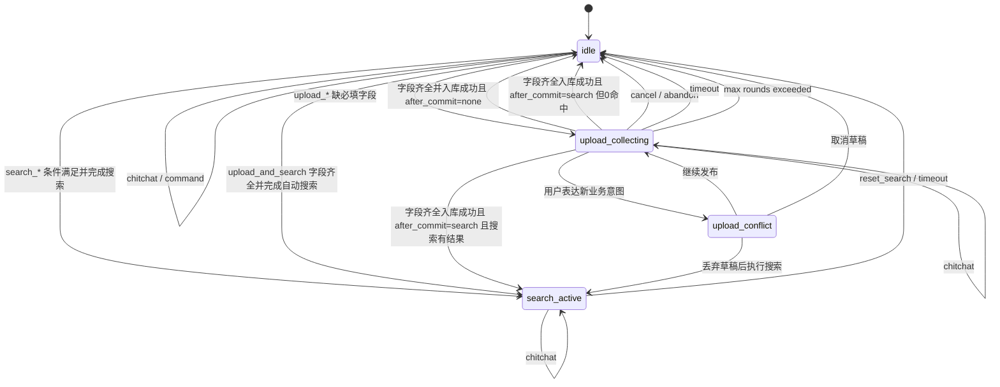

# 多轮上传 Session 状态机设计说明

> 目标：修复“发布岗位缺字段后，用户补充字段却被当成搜索追问”的断链问题，并为后续多轮对话、流程打断、取消、超时、确认和自动接续搜索建立清晰的业务状态机。

---

## 1. 背景

当前消息链路大致是：

```text
message_router
  -> intent_service.classify_intent
  -> 按 intent 分发到 upload / search / follow_up / command
```

现有 `SessionState` 更像搜索会话缓存，核心字段是 `search_criteria`、`candidate_snapshot`、`shown_items`、`current_intent` 和 `follow_up_rounds`。它没有结构化保存“正在发布岗位/简历但缺字段”的草稿状态。

因此会出现以下断链：

```text
第一句：北京饭店招聘厨师，底薪7500+绩效，包吃不包住
  -> intent = upload_job
  -> 缺 headcount
  -> process_upload 追问“招聘人数”
  -> 已抽到的 city/category/salary 等字段没有进入 pending upload 草稿

第二句：2个人
  -> intent 可能被识别为 follow_up
  -> _handle_follow_up 默认把它合并到 search_criteria
  -> search_workers 在缺少有效硬条件时可能召回全表
  -> 返回求职者推荐，而不是完成岗位入库
```

这个问题的根因不是单个 if 判断缺失，而是“上传追问”和“搜索追问”共用了 `follow_up`，但 session 没有记录当前业务流程。

---

## 2. 设计目标

1. 区分业务流程状态：上传收集、搜索活跃、上传中断确认、空闲。
2. 上传缺字段时保存结构化草稿，下一轮优先补草稿，而不是走搜索追问。
3. 支持主动取消、超时清理、最大追问轮数退出。
4. 支持 `upload_and_search` 在入库成功后自动接续对侧搜索。
5. 用户在上传过程中切换意图时，不强行吞消息，也不静默丢草稿，而是进入确认分支。
6. 明确 `history` 的语义：它只作为 LLM context window，不作为审计日志。
7. 给搜索增加安全护栏，避免无有效条件时全表召回。

---

## 3. 非目标

1. 本设计不要求一次性重写所有 LLM prompt。
2. 本设计不要求把所有多轮理解都交给 LLM。
3. 本设计不覆盖完整工作流编排引擎，只解决当前招聘上传与搜索对话的状态边界。
4. 本设计不替代 `conversation_log` 表的审计能力。
5. 本设计不在第一阶段支持多个 pending 草稿并存。若未来需要暂存多个草稿，应另行设计 `parking_lot`。

---

## 4. 核心原则

### 4.1 LLM 负责理解，状态机负责裁决

LLM 输出 intent、structured data、criteria patch 或 field patch。业务层不应把 LLM 的 `follow_up` 直接等价为“搜索追问”。

正确分工：

```text
LLM：这句话像是在补充人数 / 搜索工人 / 取消 / 闲聊
状态机：当前正在上传岗位，所以“2个人”应补 pending_upload.headcount
```

### 4.2 pending upload 是草稿，不是搜索条件

`pending_upload.data` 和 `search_state.criteria` 必须分开存储。岗位发布字段不能临时塞进 `search_criteria`。

### 4.3 所有非 idle 状态必须可退出

非空闲状态必须有：

- cancel / abandon 路径
- timeout 自动清理
- max rounds 退出
- command 打断规则
- chitchat 穿插规则

### 4.4 搜索必须有最小硬条件

即使状态机漏判，搜索层也不能在 `{headcount: 2}` 或空条件下全表召回。

---

## 5. 目标 SessionState

### 5.1 隔离假设

`SessionState` 按 `external_userid` 隔离。同一 `external_userid` 跨设备或多入口视为同一会话，因此共享同一个 `pending_upload`。

如果未来支持团队共享账号、客服代发或多人协作发布，应从 `external_userid` 单键隔离扩展为 `(external_userid, agent_id)` 或业务线程 ID 隔离。

### 5.2 长期结构

建议长期收敛为：

```python
class SessionState(BaseModel):
    role: str

    # 当前业务流程
    active_flow: str = "idle"
    # idle / upload_collecting / upload_conflict / search_active

    # 最近一次业务意图，仅用于观测和图片挂载等弱上下文
    last_intent: str | None = None

    # 上传草稿
    pending_upload: UploadDraft | None = None

    # upload_conflict 中保存的新意图瘦身版
    pending_interruption: PendingInterruption | None = None

    # 搜索状态
    search_state: SearchState = Field(default_factory=SearchState)

    # LLM 上下文窗口，不作为审计日志
    llm_context_window: list[ConversationTurn] = Field(default_factory=list)

    updated_at: str = ""
```

`SearchState` 至少包含：

```python
class SearchState(BaseModel):
    criteria: dict = Field(default_factory=dict)
    last_criteria: dict = Field(default_factory=dict)
    candidate_snapshot: CandidateSnapshot | None = None
    shown_items: list[str] = Field(default_factory=list)
    broker_direction: str | None = None
```

`PendingInterruption` 保存用户在 `upload_collecting` 中切换流程时表达的新意图，用户确认“先找工人/先找岗位”后按它重新分发：

```python
class PendingInterruption(BaseModel):
    intent: str
    structured_data: dict = Field(default_factory=dict)
    criteria_patch: list[dict] = Field(default_factory=list)
    raw_text: str = ""
```

`last_intent` 仅用于观测和日志，不参与路由决策。迁移路径：

```text
1. 阶段 C1：新增 last_intent 字段，并与 current_intent 同步写。
2. 阶段 C1：attach_image 优先使用 active_flow == "upload_collecting"，回落 current_intent。
3. 阶段 C2：删除或停止读取 current_intent。
```

### 5.3 阶段 A 过渡字段

为兼容当前代码，可以先用过渡字段实现：

```python
pending_upload: dict = Field(default_factory=dict)
pending_upload_intent: str | None = None
awaiting_field: str | None = None
pending_started_at: str | None = None
pending_updated_at: str | None = None
pending_expires_at: str | None = None
pending_raw_text_parts: list[str] = Field(default_factory=list)
pending_interruption: dict | None = None
```

后续再统一迁移为 `UploadDraft`。

注意：阶段 A 保留 `current_intent` 字段，不改 `upload_service.attach_image` 的现有判断。阶段 C1 迁移为优先使用 `active_flow == "upload_collecting"` 并回落 `current_intent`；阶段 C2 再删除或停止读取 `current_intent`。

---

## 6. UploadDraft

长期结构：

```python
class UploadDraft(BaseModel):
    entity_type: str
    # job / resume

    origin_intent: str
    # upload_job / upload_resume / upload_and_search

    data: dict = Field(default_factory=dict)
    raw_text_parts: list[str] = Field(default_factory=list)

    missing_fields: list[str] = Field(default_factory=list)
    awaiting_field: str | None = None

    follow_up_rounds: int = 0
    failed_patch_rounds: int = 0

    after_commit: str = "none"
    # none / search

    created_at: str
    updated_at: str
    expires_at: str
    # ISO 8601 UTC, e.g. "2026-04-26T10:55:00+00:00"
```

字段说明：

| 字段 | 用途 |
|---|---|
| `entity_type` | 决定最终入 `Job` 还是 `Resume` |
| `origin_intent` | 保留原始上传意图，完成草稿时复用 |
| `data` | 已抽取但尚未入库的结构化字段 |
| `raw_text_parts` | 保存多轮用户原始文本，避免最终 `raw_text` 只剩“2个人” |
| `missing_fields` | 当前仍缺的字段 |
| `awaiting_field` | 系统当前重点追问的字段 |
| `follow_up_rounds` | 系统追问轮数 |
| `failed_patch_rounds` | 用户答非所问轮数 |
| `after_commit` | `upload_and_search` 完成入库后是否继续搜索 |
| `expires_at` | 草稿自动过期时间，ISO 8601 UTC 字符串 |

时间字段约定：

```text
1. `created_at`、`updated_at`、`expires_at` 统一使用 ISO 8601 UTC 字符串。
2. 比较前必须用 datetime.fromisoformat(expires_at) 转成 datetime 对象。
3. 再与 datetime.now(timezone.utc) 比较。
4. 不允许直接做字符串比较，避免时区或格式差异导致误判。
```

`raw_text_parts` 拼接规则：

```text
1. 只保存用户原始消息，不保存系统追问文案。
2. 按时间顺序保存。
3. 入库时 raw_text = "\n".join(draft.raw_text_parts)。
4. description 默认同 raw_text，除非后续有专门的摘要字段。
```

示例：

```text
[
  "北京饭店招聘厨师，底薪7500+绩效，包吃不包住",
  "2个人"
]

入库 raw_text：
北京饭店招聘厨师，底薪7500+绩效，包吃不包住
2个人
```

这样可以保证审核、运营展示、后续重抽字段看到的是用户真实表达，而不是混入系统话术的拼接文本。

---

## 7. 状态定义

| 状态 | 含义 |
|---|---|
| `idle` | 没有活跃业务流程 |
| `upload_collecting` | 正在发布岗位/简历，但必填字段未收齐 |
| `upload_conflict` | 上传草稿未完成，但用户提出了新流程，需要确认 |
| `search_active` | 已有搜索条件和候选快照，可继续 follow_up/show_more |

---

## 8. 状态转移



---

## 9. 关键转移规则

### 9.1 上传缺字段

```text
idle + upload_job/upload_resume/upload_and_search + missing_fields 非空
  -> 创建 pending_upload
  -> active_flow = upload_collecting
  -> 保存已抽取 structured_data
  -> 保存用户原始消息到 raw_text_parts
  -> awaiting_field = missing_fields[0]
  -> origin_intent = 当前上传 intent
  -> after_commit = "search" if intent == upload_and_search else "none"
  -> 回复追问
```

### 9.2 上传字段补全

```text
upload_collecting + 用户补字段
  -> 从 structured_data / criteria_patch / regex 中提取 awaiting_field
  -> merge 到 pending_upload.data
  -> 保存用户原始消息到 raw_text_parts
  -> 重新计算 missing_fields
  -> 若仍缺字段：继续追问
  -> 若字段齐全：调用 upload_service 入库
  -> 根据 after_commit 决定回 idle 或进入 search_active
```

字段提取优先级：

```text
1. intent_result.structured_data[awaiting_field]
2. intent_result.criteria_patch 中 field == awaiting_field 的 value
3. 规则解析，例如 headcount 从“2个人/招2人/两个”中解析
```

如果用户补充的不是 `awaiting_field`，但包含其他有效上传字段，也应 merge 到 `pending_upload.data` 并重新计算 `missing_fields`。这不算失败补字段。

### 9.2.1 upload_and_search 完成后自动转搜索

```text
upload_collecting + 字段齐全且入库成功 + pending_upload.after_commit == "search"
  -> 使用入库前的 draft.data 构造对侧搜索 criteria
  -> clear pending_upload
  -> 触发对侧搜索
  -> 如果搜索有结果：active_flow = search_active，回复包含“已入库”和搜索结果两段
  -> 如果搜索 0 命中：active_flow = idle，回复包含“已入库”和“暂未找到匹配结果”两段
```

0 命中不影响入库成功本身。此时没有 `candidate_snapshot`，不应进入 `search_active`。不论搜索是否有结果，都必须把本次 criteria 写入 `session.search_state.last_criteria`，方便用户后续说“放宽点”“周边也行”时继承上下文。

方向规则：

| 用户角色/上传实体 | 自动搜索方向 |
|---|---|
| factory/broker 发布岗位 | `search_workers` |
| worker 发布简历 | `search_jobs` |

criteria 构造规则：

| 来源字段 | 搜索字段 |
|---|---|
| `city` | `city` |
| `job_category` | `job_category` |
| `salary_floor_monthly` / `salary_ceiling_monthly` | 作为岗位或简历匹配时的薪资约束 |
| `expected_cities` | `city` |
| `expected_job_categories` | `job_category` |
| `salary_expect_floor_monthly` | `salary_floor_monthly` 或按方向映射到可比薪资字段 |

实现上应复用现有 `_run_search` 或等价 orchestration 层，避免在 `upload_service` 内直接耦合搜索细节。

### 9.3 主动取消

```text
upload_collecting + 用户表达 cancel
  -> clear pending_upload
  -> active_flow = idle
  -> 回复：已取消，岗位草稿已丢弃
```

阶段 A 只做强规则匹配，不做任意子串匹配：

```text
完整句匹配：
取消 / 不发了 / 算了 / 先不发了 / 不要了

句首匹配：
不发 / 先不 / 算了，
```

不建议把“换一个”直接归为取消。它可能表示搜索语境的“换一批推荐”，也可能表示上传语境的“换个工种”。阶段 C2 可让 LLM 输出 `abandon` 或 `replace` 类别后再处理。

### 9.4 timeout 自动清

```text
任何消息进入时：
  if active_flow != idle and pending_upload.expires_at < now:
      clear pending_upload
      active_flow = idle
      继续按当前消息正常 intent 分发
```

默认建议：

```text
UploadDraft.expires_at = created_at + 10 分钟
```

实现要求：

```python
expires_at = datetime.fromisoformat(draft.expires_at)
expired = datetime.now(timezone.utc) > expires_at
```

不要用字符串直接比较 `expires_at < now`。

如果当前消息明显是字段补丁，例如“2个人”，但草稿已过期，回复：

```text
上次岗位草稿已超时，请整段重新发送岗位信息。
```

### 9.5 max rounds 退出

建议区分两个计数：

| 计数 | 含义 |
|---|---|
| `follow_up_rounds` | 系统已经追问了几次 |
| `failed_patch_rounds` | 用户连续答非所问几次 |

`failed_patch_rounds` 递增条件：

```text
1. structured_data、criteria_patch、规则解析三层都没有拿到 awaiting_field 的有效值。
2. 提取到值，但通不过类型或范围校验，例如 headcount = -1 或 salary = "很多"。
```

以下情况不递增 `failed_patch_rounds`：

```text
1. 用户发 chitchat，例如“你好”“谢谢”。
2. 用户发命令，例如 /帮助。
3. 用户没有回答 awaiting_field，但补了其他有效上传字段。
4. 用户触发 cancel 或 new_intent 分支。
```

退出策略：

```text
upload_collecting + failed_patch_rounds >= 2
  -> clear pending_upload
  -> active_flow = idle
  -> 回复：信息仍不完整，请整段重新发送岗位信息
```

如果保留当前 `MAX_FOLLOW_UP_ROUNDS=2`，则阶段 A 可沿用：

```text
upload_collecting + follow_up_rounds >= MAX
  -> clear pending_upload
  -> active_flow = idle
  -> 回复：信息仍不完整，请整段重新发送
```

长期更推荐按 `failed_patch_rounds` 退出，因为用户分两轮补不同字段是正常行为。

退出文案分阶段：

```text
阶段 A：
信息仍不完整，请整段重新发送岗位信息。

阶段 B/C 优化方向：
信息仍不完整。已收集：城市=北京、工种=餐饮、薪资=7500；缺：招聘人数。
请发送完整信息，例如：“北京饭店招厨师 2 人月薪 7500 包吃不包住”。
```

阶段 B/C 若要生成更友好的退出文案，需要在清空 pending 前保留一份 `last_data` 和 `last_missing` 用于文案构造。

### 9.6 上传中切换流程

场景：

```text
系统：还需要补充招聘人数
用户：我先看看有没有合适的厨师简历
```

不建议自动清草稿，也不建议强制当作字段补丁。推荐进入确认态：

```text
upload_collecting + LLM 判定为 search_* / upload_* 新意图
  -> active_flow = upload_conflict
  -> 保存 pending_interruption
  -> 回复：
     当前岗位还缺“招聘人数”。您要继续发布岗位，还是先找工人，或取消草稿？
```

阶段 C1 的可选动作固定为：

| 用户选择 | 行为 |
|---|---|
| 继续发布 | 回到 `upload_collecting`，继续等缺失字段 |
| 先找工人 | 清空草稿，回复“草稿已丢弃，正在为您搜索...”，执行 `pending_interruption` |
| 取消草稿 | 清空草稿，回到 `idle` |

不做“暂存草稿”分支，除非后续引入多个草稿的 `parking_lot`。

`pending_interruption` 使用瘦身版 intent，不保存完整 LLM 原始响应，避免 session 过大。用户选择“先找工人/先找岗位”后，将它还原为 `IntentResult` 所需字段并重新进入正常分发。

`is_new_business_intent` 判定规则：

```text
1. LLM intent in (search_job, search_worker)
   -> True：明确切到搜索。

2. LLM intent in (upload_job, upload_resume, upload_and_search) 且 != pending_upload.origin_intent
   -> True：切到不同实体或不同上传流程。

3. LLM intent == pending_upload.origin_intent，但 structured_data 包含 pending_upload.data 已有字段且值不同
   -> 阶段 A：仍按 field patch 处理，新值覆盖旧值。
      例：“2人” -> “改5人” 应更新 headcount，而不是新建岗位。
   -> 阶段 C2：由 LLM 输出 replace 类别区分“覆盖字段”还是“新建草稿”。

4. 其他情况
   -> False：按 field patch 处理。
```

阶段 A 如果不做 `upload_conflict`，至少不要静默执行搜索；应回复明确提示，让用户补字段或取消。

### 9.7 command 打断

命令优先级高于业务状态，但不同命令对 pending 的影响不同：

| 命令 | 行为 |
|---|---|
| `/帮助` | 不清 pending，只返回帮助 |
| `/重新找` | 清 `search_state`，不清 `pending_upload` |
| `/找岗位` / `/找工人`（broker 方向切换） | 更新 `search_state.broker_direction`；阶段 A 保留 `pending_upload` 并提醒仍在发布中，阶段 C1 进入 `upload_conflict` |
| `/取消` 或自然语言取消 | 清 pending |
| `/人工客服` | 不强制清 pending |
| `/删除我的信息` | 按现有删除流程，必要时清 session |

`/重新找` 的固定行为：

```text
1. 清 search_state.criteria、candidate_snapshot、shown_items。
2. 不清 pending_upload。
3. 如果 active_flow == upload_collecting：
   回复“搜索条件已重置；您仍在发布岗位（缺 X），请继续补充或发 /取消 放弃。”
4. 否则回复“搜索条件已清空。”
```

broker 在 `upload_collecting` 中切换方向时，阶段 A 的推荐回复：

```text
方向已切换；您仍在发布岗位（缺 X），请继续补充或发 /取消 放弃。
```

### 9.8 闲聊穿插

```text
upload_collecting + chitchat
  -> 保留 pending_upload
  -> 不递增 follow_up_rounds
  -> 不递增 failed_patch_rounds
  -> 回复闲聊文本 + 当前未完成事项提示
```

示例：

```text
好的。您当前还在发布岗位，请补充招聘人数。
```

```text
search_active + chitchat
  -> 保留 search_state
  -> 回复闲聊文本
  -> 可附带“如需继续看结果，可以说更多/换一批”
```

---

## 10. 路由伪代码

```python
def handle_text(msg, user_ctx, db):
    session = load_or_create_session(user_ctx)
    record_context_window(session, "user", msg.content)

    intent_result = classify_intent(...)

    # 1. 命令优先，但状态相关命令要先过状态机边界
    if intent_result.intent == "command":
        return _route_command(intent_result, msg, user_ctx, session, db)

    # 2. 过期检查
    if pending_expired(session):
        clear_pending_upload(session)
        if looks_like_upload_patch(msg.content):
            return reply("上次岗位草稿已超时，请整段重新发送岗位信息。")
        # 否则当前消息继续正常分发

    # 3. cancel 优先于字段补全
    if session.active_flow == "upload_collecting" and is_cancel(msg.content, intent_result):
        clear_pending_upload(session)
        return reply("已取消，岗位草稿已丢弃。")

    # 4. 非 idle 闲聊穿插
    if session.active_flow in ("upload_collecting", "search_active") and intent_result.intent == "chitchat":
        return handle_chitchat_during_flow(intent_result, msg, session)

    # 5. 上传草稿优先补字段
    if session.active_flow == "upload_collecting":
        if is_new_business_intent(intent_result):
            return enter_upload_conflict(session, intent_result, msg)
        return handle_upload_field_patch(intent_result, msg, session, db)

    # 6. 冲突确认态
    if session.active_flow == "upload_conflict":
        return handle_upload_conflict_choice(intent_result, msg, session, db)

    # 7. 正常分发
    return dispatch_by_intent(intent_result, msg, session, db)
```

helper 约定：

| helper | 阶段 A 规则 |
|---|---|
| `is_cancel` | 只做 §9.3 的完整句/句首强规则匹配 |
| `looks_like_upload_patch` | 当前文本是短数字、人数、薪资、城市/工种片段等明显补字段表达 |
| `is_new_business_intent` | 按 §9.6 的四条规则判定 |
| `pending_expired` | 解析 ISO 8601 UTC 字符串后与 `datetime.now(timezone.utc)` 比较 |

命令分两类处理：

```text
全局型命令（/帮助、/我的状态、/人工客服、/续期、/下架、/招满了、/删除我的信息）
  -> 直接走 command_service

状态相关命令（/找岗位、/找工人、/重新找、/取消）
  -> 先检查 active_flow，再决定是否进入 upload_conflict、清 pending 或重置搜索
```

`looks_like_upload_patch` 阶段 A 使用正则和词典规则：

```text
1. 纯数字 1-3 位，例如“2”“30”。
2. 人数表达，例如“2个”“2人”“2位”“招30人”。
3. 薪资片段，例如含“千”“月薪”，或 4-5 位数字。
4. 单一城市名，例如“北京”“苏州”。
5. 单一工种关键词，例如“厨师”“保洁”“普工”。
```

阶段 C2 可复用 LLM 输出的 `type=field_patch` 替代这组启发式规则。

---

## 11. 搜索安全护栏

搜索护栏分两层：

1. orchestration 层负责从当前请求、session 和用户资料中补默认搜索条件。
2. `_query_jobs` / `_query_resumes` 底层查询函数只接受已经规整好的 criteria，并拒绝无效召回。

orchestration 层落点：

```text
阶段 A：`message_router._run_search`
阶段 B/C：可视复杂度抽成 `search_orchestrator.py`
```

默认 criteria 合并顺序固定如下，已有字段不覆盖：

```text
1. intent_result.structured_data 或当前请求显式 criteria
2. session.search_state.last_criteria
3. 仅 worker 角色：用户最近一份 passed resume 的 expected_cities / expected_job_categories
```

“已有字段不覆盖”的判定标准：

```text
仅当上层 source 未提供该 key，或值为 falsy（None / 空字符串 / 空列表）时，才用下层 default 补齐。
例：intent_result.criteria = {"city": []} 视为未提供，可被简历 default 的 city = ["无锡"] 覆盖。
```

合并完成后再调用 `search_service.search_jobs/search_workers`，底层 `_query_*` 不负责查用户简历或补默认条件。

有效搜索条件定义：

```text
当前请求 criteria 中 city 或 job_category 至少一个非空
OR
orchestration 层能从以下默认源补齐：
  1. session.search_state.last_criteria
  2. worker 最近简历的 expected_cities / expected_job_categories
```

底层查询函数仍保持简单护栏：

```python
def has_effective_search_criteria(criteria: dict) -> bool:
    return bool(criteria.get("city") or criteria.get("job_category"))
```

`_query_jobs` 和 `_query_resumes` 在查询前检查：

```text
if not has_effective_search_criteria(criteria):
    return []
```

对于 worker 找岗位和 factory/broker 找工人，最小条件可以后续细化：

| 方向 | 最小硬条件 |
|---|---|
| search_job | city 或 job_category 至少一个 |
| search_worker | city 或 job_category 至少一个 |

这样即使“2个人”误入搜索，也不会全表召回。阶段 A 不建议把“读取用户最近简历”的逻辑塞进 `_query_*`，应放在 router/search orchestration 层。

---

## 12. history 语义

当前 `SessionState.history` 应明确为：

```text
LLM context window，只保存最近 N 条对话，用于 prompt 上下文。
```

它不保证完整、不用于审计、不用于运营追溯。审计和完整对话查询应使用 `conversation_log` 表。

长期建议：

```python
history -> llm_context_window
```

如果短期不改名，至少补充字段注释：

```text
最近 N 条 LLM 上下文窗口，不作为审计日志；完整日志见 conversation_log。
```

---

## 13. 分阶段落地

### 阶段 A：演示阻塞修复

目标：先修复“补招聘人数后推荐求职者”的演示问题。

必做范围：

1. `SessionState` 增加 pending upload 过渡字段。
2. `upload_service.process_upload` 在 missing 分支保存 pending。
3. `message_router` 在正常 follow_up 分发前拦截 pending upload 字段补全。
4. `search_service` 增加 `has_effective_search_criteria` 守卫。
5. 退出路径必做：
   - timeout 退出：检查 `pending_expires_at`。
   - cancel 退出：使用 §9.3 的关键词强规则。
   - max rounds 退出：阶段 A 沿用现有 `MAX_FOLLOW_UP_ROUNDS=2`，按 `follow_up_rounds` 计数。
6. 入库成功后清 pending，并保证 `raw_text` 使用用户原始消息拼接。

阶段 C1 再引入 `failed_patch_rounds`，替换 `follow_up_rounds` 作为 max rounds 的主要计数依据。

阶段 A 推迟项：

1. `upload_conflict` 确认态。
2. `failed_patch_rounds` 精细计数。
3. LLM session context hint。
4. 多草稿暂存。

注意点：

- `SessionState` 当前定义在 `backend/app/schemas/conversation.py`。
- 它是 Pydantic `BaseModel`，新字段要用默认值保证旧 Redis session 反序列化不崩。
- 补字段时要同时读取 `structured_data`、`criteria_patch` 和规则解析。
- 最终入库的 `raw_text` 应使用 `raw_text_parts` 拼接，而不是只用最后一句“2个人”。
- 实施细节：`message_router._handle_field_patch` 调 `upload_service.process_upload` 前，用 `"\n".join(draft.raw_text_parts)` 构造 `raw_text` 传入，不再使用 `msg.content` 作为最终入库原文。
- 保留 `current_intent` 字段，避免影响当前图片附件挂载逻辑。

### 阶段 B：推荐质量和字段规整

目标：提高 LLM 抽取和搜索 fallback 的质量。

范围：

1. prompt 增加岗位类别映射 few-shot，例如厨师 -> 餐饮。
2. `intent_service` 增加字段规整层，将非标准类目映射到字典。
3. `search_service` 增加 0 命中 fallback，例如先放宽城市，再放宽工种。
4. 优化兜底文案，避免像推荐结果。
5. 在 orchestration 层补默认搜索条件，例如 worker 最近简历或 `last_criteria`。

### 阶段 C1：兼容式状态机落地

目标：先让 `active_flow` 成为路由裁决源，同时保留 Stage A/B 的扁平 session 字段，降低测试和 Redis 兼容风险。

范围：

1. 新增 `active_flow`，并在 `load_session` 中仅对旧 session 做一次推导。
2. 新增 `last_intent`；`last_intent` 记录本轮 LLM 意图，只用于观测和日志，不参与路由。`upload_collecting` 期间 `current_intent` 钉在 `pending_upload_intent`，用于兼容旧图片挂载回落。
3. 新增 `pending_interruption`、`failed_patch_rounds`、`last_criteria` 等字段。
4. 保留 `pending_upload`、`awaiting_field`、`follow_up_rounds`、`search_criteria` 等扁平字段。
5. 增加 `_route_idle`、`_route_upload_collecting`、`_route_upload_conflict`、`_route_search_active`，现有 `_handle_*` 复用为 helper。
6. `attach_image` 优先看 `active_flow == "upload_collecting"`，回落 `current_intent` 兼容旧 session。
7. LLM `session_hint` 先加形参和构造占位，不强制改 prompt。

验收重点：行为满足状态机要求，但不要求完成 `UploadDraft/SearchState/llm_context_window` 嵌套结构迁移。

PR 节奏：C1 单独一个 PR，合主线并在 mock-testbed 跑 1-2 天稳定后再开 C2 PR，不要把 C1/C2 塞进同一个 PR。

### 阶段 C2：SessionState 结构收敛

目标：在 C1 行为稳定后，把过渡字段收敛为显式嵌套结构。

范围：

1. 将扁平 pending 字段迁移为 `UploadDraft`。
2. 将 `search_criteria/candidate_snapshot/shown_items/broker_direction/last_criteria` 迁移为 `SearchState`。
3. 将 `history` 改名或迁移为 `llm_context_window`。
4. 停止读取并清理 `current_intent`，保留 `last_intent` 作为观测字段。
5. 删除 C1 兼容回落逻辑，补齐旧 Redis session 过期或迁移策略。

---

## 14. 测试矩阵

至少覆盖以下场景：

| Case | 输入 | 期望 |
|---|---|---|
| 补字段成功 | “北京饭店招厨师7500” -> “2个人” | 岗位入库，不推荐求职者 |
| 补字段仍缺 | “北京饭店招厨师” -> “2个人” | 继续追问薪资/计薪方式 |
| 答非所问 | “北京饭店招厨师7500” -> “还行吧” | 提示补招聘人数，failed count +1 |
| 取消 | “北京饭店招厨师7500” -> “取消” | 清草稿，回 idle |
| timeout | 第一轮后超过 10 分钟 -> “2个人” | 提示草稿超时，要求整段重发 |
| 命令打断 | 第一轮后 -> “/帮助” | 返回帮助，不误入搜索 |
| /帮助 不清 pending | 第一轮后 -> “/帮助” -> “2个人” | 帮助返回后仍能补 pending |
| 切搜索流程 | 第一轮后 -> “先看看厨师简历” | 进入确认或提示先补字段/取消 |
| 新岗位替换 | 第一轮后 -> “改成上海保洁招3人” | 进入确认，避免静默覆盖 |
| upload_and_search 自动转 | “招厨师5人月薪8000，顺便找人” | 入库岗位并自动 `search_workers` |
| upload_and_search 0 命中 | “招厨师5人月薪8000，顺便找人” + 工人池无匹配 | 岗位入库成功，回复“已入库”+“暂未找到”，active_flow=idle |
| 闲聊不耗失败次数 | upload_collecting 中 -> “你好” | 闲聊回复 + 提示未完成，failed_patch_rounds 不变 |
| 同字段连续覆盖 | “2人” -> “改5人” | pending.headcount 从 2 更新为 5 |
| 搜索护栏 | criteria 只有 `{headcount: 2}` | 返回空，不全表召回 |
| raw_text 拼接 | 第一轮 + 第二轮补字段入库 | raw_text 包含两轮用户文本 |

---

## 15. 观测与日志

建议记录以下事件，便于排查：

| 事件 | 字段 |
|---|---|
| `upload_pending_started` | userid, origin_intent, missing_fields |
| `upload_pending_patched` | userid, field, missing_fields_after |
| `upload_pending_cancelled` | userid, reason |
| `upload_pending_expired` | userid, age_seconds |
| `upload_pending_conflict` | userid, old_flow, new_intent |
| `upload_completed_with_search` | userid, entity_id, search_result_count |
| `upload_max_rounds_exceeded` | userid, follow_up_rounds, missing_fields |
| `chitchat_during_pending` | userid, active_flow |
| `search_blocked_empty_criteria` | userid, criteria |

---

## 16. 验收标准

1. 用户发布岗位缺人数后，补“2个人”能完成入库。
2. 补字段过程中不会调用搜索推荐。
3. 空 criteria 或无 city/job_category 的搜索不会全表召回。
4. 用户可取消 pending upload。
5. pending upload 超时后不会被无期限续命。
6. 命令可打断，但行为符合命令语义。
7. `upload_and_search` 入库后能自动接续搜索。
8. `upload_and_search` 0 命中时仍确认入库成功，并回到 `idle`。
9. 闲聊不会消耗 pending upload 的失败补字段次数。
10. 完整日志仍以 `conversation_log` 为准，session 中的 context window 不承担审计职责。
