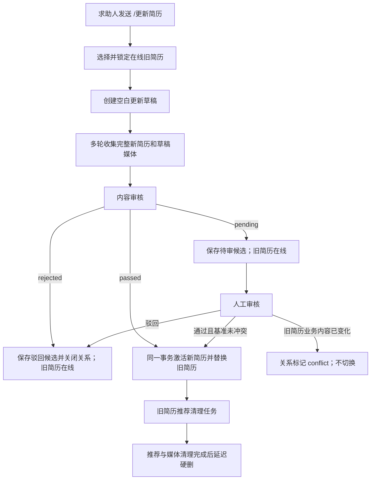

# 简历自动过期与全量更新实施方案 v0.1

## 1. 文档信息

| 项目 | 内容 |
|---|---|
| 文档名称 | 简历自动过期与全量更新实施方案 |
| 版本 | v0.1 |
| 编制日期 | 2026-08-16 |
| 调研基线 | `main`，提交 `64bbc07917bcff4fb38301c1404059c45d08c409` |
| 参考方案 | `docs/岗位自动过期与全量更新实施方案_v0.5.md` |
| 需求对象 | 求助人，即系统角色为 `worker` 的简历上传者 |
| 涉及范围 | 简历首次上传、人工审核、自动过期、全量更新、推荐清理、媒体清理、运营后台、上线迁移 |
| 本期不包含 | 求助人字段级部分修改、求助人简历续期命令、批量重算已有在线简历有效期、修改岗位生命周期实现 |

### 1.1 调研方法与边界

本文只调研 `main` 分支的实际代码，不以当前工作区分支、未提交文件或历史工作树作为实现依据。所有“现状”结论均对应上述基线提交。

本方案复用岗位生命周期已经验证的设计原则，但不直接改造或抽象岗位链路。简历先使用独立的关系表和服务实现，避免为追求复用而扩大岗位回归范围。

## 2. 结论摘要

当前简历已经具备基础 TTL：上传时读取 `ttl.resume.days`，搜索和翻页时实时排除过期记录，每日任务会软删除过期简历，并在延迟期后清理媒体和物理删除记录。因此“到期后不再被新搜索召回”已经成立。

但现状还不能完整满足本需求，主要原因如下：

1. 简历 TTL 从“入库时间”开始计算，而不是从“审核通过并激活的时间”开始计算；待审时间会消耗业务有效期。
2. 待审或驳回简历也持有业务 `expires_at`，审核状态和生命周期状态没有分离。
3. 求助人再次上传只会创建另一份简历，没有“完整新版本替换指定旧版本”的关系和原子切换。
4. 简历过期仅批量写 `deleted_at`，没有版本递增、单条锁定和持久化推荐清理任务。
5. 简历硬删除只以媒体清理完成为门禁，没有等待推荐投递、对话日志和 Redis 会话中的目标引用清理完成。
6. 简历更新草稿中的图片没有进入草稿媒体集合，存在图片误挂到旧简历的可能。
7. 推荐搜索读与 `prepare_delivery()` 持久化之间没有再次锁定并复核简历；旧读事务可能在简历下架和清理之后晚到写入新的 delivery、outbox 或会话快照。
8. 现有迁移流程没有约束滚动部署中的旧实例增量写入，也没有修复 legacy 媒体缺失和已物理删除简历的孤儿推荐引用。

推荐方案是将简历生命周期升级为与岗位一致的“两阶段候选 + 原子激活”模型：

- 首次上传或全量更新先生成候选简历；候选只设置 `candidate_expires_at`，不设置业务 `expires_at`。
- 审核通过时在短事务内激活候选，按当时配置计算 `expires_at`。
- 全量更新审核通过时，在同一数据库事务内激活新简历、将旧简历标记为 `replaced`，并创建旧简历的持久化推荐清理任务。
- 推荐事实持久化前按简历 ID 升序锁定并复核所有目标；持久化事务与过期、替换、下架共用 `Resume` 行锁，禁止清理成功后再晚到写入旧目标。
- 到达 `expires_at` 后，在线查询立即排除；高频任务补写软删除状态和清理任务；推荐清理与媒体清理均完成后才允许硬删除。
- 上线采用停写切换屏障、兼容版全量部署、带水位回填和不变量归零；不允许旧写实例与新生命周期写实例同时接收写流量。

## 3. 需求定义

### 3.1 简历默认有效期

1. 简历通过自动审核或人工审核并成功激活时，读取 `system_config.ttl.resume.days`。
2. 业务有效期计算规则为：

   ```text
   activated_at = 本次成功激活时间
   expires_at = activated_at + ttl.resume.days
   ```

3. 默认有效期为 30 天，允许后台配置 1 至 3650 天。
4. 后台配置变更只影响变更后激活的简历，不追溯重算已激活简历。
5. 候选简历不设置 `activated_at` 和业务 `expires_at`，使用独立的 `candidate_expires_at` 控制候选保留时间。
6. 候选保留期读取 `ttl.resume.candidate.days`，默认 7 天，允许后台配置 1 至 365 天。
7. 到达 `expires_at` 后，简历必须立即从新搜索、推荐翻页、搜索默认条件和图片追加目标中排除，不依赖定时任务是否已经运行。
8. 高频任务将到期简历软删除并记录：

   ```text
   delist_reason = expired
   deleted_at = 当前时间
   version = version + 1
   ```

   本文所有生命周期 `DATETIME(6)`（`activated_at`、`expires_at`、`candidate_expires_at`、`deleted_at`）均以 **UTC naive** 写入和比较；文中的 `now`、当前时间和迁移时间都指同一 UTC 时刻。应用事务只取时一次：`now_utc = to_naive_utc(utc_now())`，并把它绑定为 `:now_utc`；激活、自然过期、候选回收、软删和硬删不得用受 MySQL session `time_zone` 影响的 `NOW()`/`CURRENT_TIMESTAMP()`。纯 SQL 迁移在开始时固定 `SET @phase11_now_utc = UTC_TIMESTAMP(6)`，整步复用该值。硬删边界由应用计算并绑定 `:hard_delete_cutoff_utc = to_naive_utc(utc_now() - timedelta(days=delay_days))`，条件为 `deleted_at <= :hard_delete_cutoff_utc`。

9. 软删除达到 `ttl.hard_delete.delay_days` 后，只有推荐清理和媒体清理均成功，才允许物理删除简历记录。
10. 管理员延期继续只允许增加 15 或 30 天，计算规则固定为：

    ```text
    base = max(expires_at, now)
    ceiling = max(expires_at, activated_at + 2 * 当前 ttl.resume.days)
    new_expires_at = min(base + requested_days, ceiling)
    ```

    `base >= ceiling` 时返回 `extension_limit_reached`，不得写一次无变化的成功记录。配置上调会扩大后续延期上限；配置下调不缩短已有 `expires_at`，但可能阻止继续延期。legacy history、候选、已下架和存在活动替换关系的简历均不得延期。

### 3.2 全量更新语义

本期“更新简历”定义为：求助人提交一份不依赖旧简历字段的完整新简历，审核通过后由新记录替换指定旧记录。

必须满足以下规则：

- 不支持“只把期望工资改为 7000”“只增加一个期望城市”等字段级更新。
- 更新草稿必须从空数据开始，不得从旧简历复制必填或可选业务字段补齐新简历。
- 多轮追问可以补齐一份新简历，但每个字段都必须来自本次更新会话。
- 新简历必须重新执行内容审核，不继承旧简历审核结论。
- 审核为 `pending` 时旧简历保持在线，新简历只作为候选，不进入匹配池。
- 审核为 `rejected` 时关闭候选关系，旧简历保持在线。
- 审核为 `passed` 时，激活新简历、替换旧简历和创建旧简历清理任务必须在同一事务完成。
- 激活新简历时从激活时间重新计算完整 TTL，不继承旧简历剩余时间。
- 技术异常或并发冲突不得造成“旧简历已下线但新简历未激活”。
- 新简历使用新 ID；旧 ID保留为历史记录直到满足硬删除条件。

### 3.3 用户入口与目标选择

一期使用明确命令作为稳定入口：

```text
/更新简历
/更新简历 123
```

同时支持精确自然语言别名：

```text
更新简历
修改简历
重新提交简历
```

目标选择规则：

| 场景 | 处理方式 |
|---|---|
| 当前用户不是 `worker` | 拒绝操作 |
| 指定简历 ID | 校验记录存在、属于当前用户且处于可更新的在线状态 |
| 未指定 ID，只有一份在线简历 | 自动选中 |
| 未指定 ID，有多份在线简历 | 返回 ID、期望城市、期望工种和到期时间，要求明确选择 |
| 简历属于其他用户 | 返回“未找到可更新简历”，不泄露记录详情 |
| 简历已过期、已下架、已被替换或已软删除 | 不允许更新，提示重新上传完整简历 |
| 该简历已有进行中的更新候选 | 拒绝重复发起，提示等待审核或联系客服取消候选 |

不得静默选择“最新一份”简历，避免多份简历场景下替换错误目标。

### 3.4 生命周期状态

| 状态 | `audit_status` | `activated_at` | `expires_at` | `candidate_expires_at` | `deleted_at` | `delist_reason` | 是否可搜索 |
|---|---|---|---|---|---|---|---|
| 待审候选 | `pending` | `NULL` | `NULL` | 非空 | `NULL` | `NULL` | 否 |
| 驳回候选 | `rejected` | `NULL` | `NULL` | 非空 | `NULL` | `NULL` | 否 |
| 在线版本 | `passed` | 非空 | 非空 | `NULL` | `NULL` | `NULL` | 是，且 `expires_at > now` |
| 自然过期 | `passed` | 非空 | 非空 | `NULL` | 非空 | `expired` | 否 |
| 被新版本替换 | `passed` | 非空 | 非空 | `NULL` | 非空 | `replaced` | 否 |
| 管理员下架 | `passed` | 非空 | 非空 | `NULL` | 非空 | `manual_delist` | 否 |
| 用户删除信息 | 任意 | 任意 | 任意 | 任意 | 非空 | `user_deleted` | 否 |
| 已清理候选 | `pending/rejected` | `NULL` | `NULL` | 非空 | 非空 | `NULL` | 否 |

### 3.5 删除语义

| 层次 | 触发时机 | 行为 |
|---|---|---|
| 在线失效 | `expires_at <= now` 或替换事务提交 | 立即从所有在线读取路径排除 |
| 业务软删除 | 高频任务或替换事务 | 写 `deleted_at`、原因和新版本，建立推荐清理任务 |
| 推荐清理 | 持久化 worker | 清推荐正文、候选引用、对话投递引用和 Redis 会话索引 |
| 媒体清理 | 持久化 worker | 将对象存储文件标为待删，重试到成功或死信 |
| 物理删除 | 软删延迟到期且两个清理门禁均通过 | 删除 `resume` 行 |

关系表不对旧、新简历建立数据库外键，避免简历硬删除被历史关系阻塞；关系记录作为审计链保留，后续若需要清理应单独定义保留期。

### 3.6 非功能要求

- 幂等：相同 `operation_id` 或相同企微消息 ID 重放只能生成一个候选和一条替换关系。
- 并发安全：更新候选创建、管理员编辑、管理员延期、过期任务和人工审核不得互相覆盖。
- 可恢复：推荐或媒体删除失败必须可重试，失败状态不能通过硬删丢失定位信息。
- 可观测：候选创建、激活、冲突、过期积压、清理死信均应有结构化指标或日志。
- 隐私：日志只记录哈希后的用户标识；不得记录完整简历文本、手机号或媒体 URL。
- 兼容：功能开关关闭时，搜索和后台必须仍可读取迁移前的历史简历。
- 写入隔离：任何包含简历目标的推荐事实、delivery、outbox 和持久化 session patch，必须在锁定并复核目标简历后于同一事务写入；清理完成后不得出现晚到目标引用。
- 切换安全：生命周期回填期间不得有不理解新列的旧实例接收写流量；兼容版即使业务开关关闭也必须写出合法的新旧生命周期双格式。
- 灰度一致：是否允许发起更新由数据库统一 allowlist 决定，并在请求开始时持久化 cohort；后续轮次不得因配置变化改组。

## 4. `main` 分支现状

### 4.1 已具备能力

#### 4.1.1 数据模型与索引

`backend/app/models.py` 和 `backend/sql/schema.sql` 中的 `Resume` 已包含：

- 审核字段：`audit_status`、`audit_reason`、`audited_by`、`audited_at`；
- 生命周期字段：`created_at`、`updated_at`、`expires_at`、`deleted_at`；
- 乐观锁字段：`version`；
- 媒体字段：`images`、`miniprogram_url`；
- `idx_expires` 和包含审核、删除、到期条件的 `idx_filter_hot`。

`expires_at` 当前为 `NOT NULL`，简历没有 `activated_at`、`candidate_expires_at` 和 `delist_reason`。

#### 4.1.2 上传和 TTL 配置

`backend/app/services/upload_service.py` 的 `_read_ttl_days()` 会读取 `ttl.resume.days`，缺失或转换失败时回退 30 天；`_create_resume()` 在创建记录时直接设置：

```text
expires_at = now + ttl.resume.days
```

`backend/sql/seed.sql`、`backend/sql/migrations/phase7_001_ensure_system_config.sql` 和 `backend/app/tasks/common.py` 已包含 `ttl.resume.days=30`。

#### 4.1.3 审核

上传内容会先经过 `audit_service.audit_content_only()`。自动审核结果直接写入简历：

- `passed`：立即可进入匹配池；
- `pending`：进入人工审核队列；
- `rejected`：保留驳回记录。

`backend/app/services/audit_workbench_service.py` 的简历人工通过路径只更新 `audit_status`、审核人和审核时间，不重新计算 `expires_at`。

#### 4.1.4 在线查询实时排除过期简历

`backend/app/services/search_service.py` 的初次查询和 `show_more` ID 复核均要求：

```text
audit_status = passed
deleted_at IS NULL
expires_at > 当前时间
owner.status = active
```

`backend/app/services/message_router.py` 读取求助人最近简历作为找工作默认条件时，也使用同样的审核、删除和到期过滤。因此即使软删除任务还没运行，到期简历也不会进入这些在线路径。

#### 4.1.5 软删除、媒体清理与硬删除

`backend/app/tasks/ttl_cleanup.py` 每日 03:00 执行：

1. 现有任务以受 MySQL session `time_zone` 影响的数据库当前时间比较 `expires_at`，再将命中且未删除的简历批量写入 `deleted_at`；phase11 必须按第 3.1 节改为绑定 UTC-naive 参数；
2. 软删除超过 `ttl.hard_delete.delay_days` 的简历进入硬删除扫描；
3. 先通过 `media_asset_lifecycle` 将简历图片交给持久化媒体 worker；
4. 媒体全部删除后才物理删除简历行。

`backend/app/services/job_media_service.py` 的实体媒体接口已经支持 `entity_type='resume'`，无需再建立一套媒体表。

#### 4.1.6 推荐隐私清理基础设施

`target_cleanup_task` 表本身允许任意 `target_type`，推荐隐私服务也支持 `TargetRef('resume', id)`，能够清理：

- 推荐 delivery 和 outbox 中的目标引用或正文；
- 关联 `conversation_log`；
- Redis 推荐会话和候选快照。

但 `backend/app/services/target_cleanup_service.py` 目前只暴露岗位专用的创建和完成检查方法，简历过期路径尚未接入。

#### 4.1.7 后台管理

后台已支持简历列表、详情、字段级编辑、下架和延期，并使用 `version` 做乐观锁。前端可展示到期时间，但没有候选、激活、替换关系和历史状态视图。

### 4.2 当前缺口与风险

| 编号 | 缺口 | 直接影响 |
|---|---|---|
| G1 | `expires_at` 在创建时计算 | 人工待审时间消耗有效期 |
| G2 | 待审、驳回记录也有业务 TTL | 审核状态与生命周期状态混杂 |
| G3 | 无 `update_resume` 命令和替换关系 | 再次上传只会新增，不能表达替换 |
| G4 | 无原子激活服务 | 无法保证旧版本下线与新版本上线原子完成 |
| G5 | 无候选保留期和候选清理任务 | 待审/驳回候选长期堆积 |
| G6 | 过期任务为无锁批量 UPDATE，且不递增 `version` | 会与后台编辑、延期产生竞态 |
| G7 | 简历过期不创建 `target_cleanup_task` | 历史推荐和会话可能继续引用失效简历 |
| G8 | 简历硬删只等待媒体，不等待推荐清理 | 可能先丢失目标行，后续清理无法可靠重试 |
| G9 | 简历无下架原因 | 无法区分自然过期、管理员下架和版本替换 |
| G10 | 草稿图片逻辑只对岗位草稿生效 | 更新简历时图片可能误挂旧简历 |
| G11 | `ttl.resume.days` 只校验“是整数” | 允许 0、负数或不合理大值 |
| G12 | 后台人工通过简历不重算 TTL | 通过后剩余时间可能不足，甚至已经过期 |
| G13 | 后台编辑、延期、下架不了解替换关系 | 审核基准可能被并发修改 |
| G14 | `/删除我的信息` 不关闭进行中的简历替换关系 | 用户删除后候选可能被误激活 |
| G15 | `ResumeRead.expires_at` 为必填非空 | 无法返回候选简历 DTO |
| G16 | `/我的状态` 只按 `deleted_at` 取最近简历 | 不能正确区分在线版本和更新候选 |
| G17 | `prepare_delivery()` 写推荐事实前不锁定复核简历 | 搜索旧读可能在下架和清理后晚到写入旧目标 |
| G18 | 回填没有旧实例停写屏障和增量水位 | 回填后仍可能产生旧格式 pending/rejected 行 |
| G19 | legacy `resume.images` 与媒体生命周期缺失未修复 | 对象可能泄漏，或硬删门禁永久阻塞 |
| G20 | 旧任务可能已物理删除简历但推荐仍引用其 ID | 无 Resume 行可供通用清理入口加锁，孤儿引用无法闭环 |

## 5. 总体技术方案

### 5.1 主流程



### 5.2 数据模型

#### 5.2.1 扩展 `resume`

新增或调整字段：

| 字段 | 类型 | 规则 |
|---|---|---|
| `activated_at` | `DATETIME NULL` | 激活时间；候选为空 |
| `candidate_expires_at` | `DATETIME NULL` | 候选回收时间；在线版本为空 |
| `expires_at` | `DATETIME NULL` | 改为可空；只对激活版本非空 |
| `delist_reason` | `ENUM('manual_delist','expired','replaced','user_deleted') NULL` | 在线为空，历史记录原因；已清理候选和 legacy history 可为空 |

新增索引：

```text
idx_resume_candidate_expiry(audit_status, candidate_expires_at)
idx_resume_hard_delete(deleted_at, id)
```

保留现有 `idx_expires` 和 `idx_filter_hot`。`idx_resume_hard_delete` 服务于按 `deleted_at,id` 的 keyset 硬删扫描；迁移后必须用生产量级数据执行 `EXPLAIN ANALYZE`，若优化器不能稳定使用该索引则不得开启简历硬删除。

#### 5.2.2 新增 `resume_replacement`

字段设计与 `job_replacement` 保持一致，但使用独立表和命名：

| 字段组 | 字段 |
|---|---|
| 幂等 | `operation_id`、`source_msg_id`，均唯一 |
| 身份 | `owner_userid`、`old_resume_id`、`new_resume_id` |
| 并发基准 | `old_resume_version`、`old_expires_at`、`old_business_digest`、`old_business_digest_version` |
| 审核 | `review_outcome`、`reviewed_at`、`reviewed_by` |
| 生命周期 | `lifecycle_status`、`active_old_resume_id`、`closed_reason`、`conflict_reason` |
| 时间 | `activated_at`、`candidate_cleaned_at`、`created_at`、`updated_at` |

关键唯一约束：

```text
UNIQUE(operation_id)
UNIQUE(source_msg_id)
UNIQUE(new_resume_id)
UNIQUE(active_old_resume_id)
```

`active_old_resume_id` 仅在 `awaiting_review` 或 `conflict` 时保存旧 ID；关闭或激活关系时置空。这个唯一键保证同一旧简历最多只有一个进行中的更新。

关系中的 `old_resume_version` 定义为“候选关系建立事务已经将旧简历 `version+1` 后的版本”，不是加版本之前的调用方版本。后续自然过期恰好再递增一次，因此可用 `base+1` 严格识别；禁止实现方自行改变这个基准时点。

#### 5.2.3 新增迁移、媒体隔离与灰度表

新增以下运维数据结构；它们属于可恢复协议，不得只存在于发布脚本内存中：

| 表 | 关键字段与用途 |
|---|---|
| `phase11_migration_ledger` | `migration_key` 唯一、脚本 SHA-256、`stage/kind/status/attempt`、`last_statement_ordinal`、`resume_cursor_json`、`started_at/completed_at`、`cutover_resume_id`、build 探针摘要、执行人、错误码和校验摘要；记录 SQL/Python 各步及 verify 结果 |
| `resume_media_reconcile_issue` | `resume_id`、引用位置、对象 key 哈希、问题类型、`status`、处置动作、审核人和时间；不保存可访问 URL；未解决记录是硬删门禁 |
| `resume_replacement_rollout_assignment` | `operation_id` 唯一、`owner_userid`、`cohort`、allowlist revision、`source_msg_id`、创建时间；请求开始即写入，后续轮次只读取，不重新分组 |

灰度 allowlist 使用受权限保护的数据库 `system_config` JSON 配置 `resume.replacement.rollout.allowlist`，默认空列表，并维护单调递增 revision。该 key 不在通用配置列表中明文展示；只有授权管理员可经专用接口修改并写审计日志。assignment 保留当时 revision，使配置变化不改变已开始操作的 cohort。

### 5.3 候选创建与激活

#### 首次上传

- 自动通过：先按候选形态创建，再调用统一激活函数；事务提交后直接在线。
- 待人工审核：保存 `pending` 候选，只有 `candidate_expires_at`。
- 自动驳回：保存 `rejected` 候选，只有 `candidate_expires_at`，等待候选清理。

#### 全量更新

- 创建候选前锁旧简历，校验所有权、在线状态、版本和是否已有活动关系。
- 创建候选时旧简历 `version + 1`，并将递增后的值保存为关系的 `old_resume_version`；这个值是后续判断“完全未变”与“只发生一次自然过期”的唯一版本基准。
- 对旧简历业务字段生成版本化 SHA-256 摘要；摘要覆盖所有匹配字段、描述、媒体引用和 `extra`，不覆盖生命周期字段。
- 自动通过时在创建事务内激活；人工通过时重新锁定旧简历、新简历和关系后激活。

#### 原子激活

同一事务执行：

1. 校验关系、所有权和旧/新 ID 一致；
2. 校验候选未过期、尚未激活；
3. 按第 5.4 节校验旧简历完全未变，或严格满足“仅自然过期”例外；
4. 设置新简历 `audit_status='passed'`、`activated_at=now_utc`、`expires_at=now_utc+TTL`、`candidate_expires_at=NULL`、`version+1`；
5. 旧简历仍在线时设置 `delist_reason='replaced'`、`deleted_at=now_utc`、`version+1`；若只发生自然过期，则原样保留旧简历的 `expired/deleted_at/version`，不覆盖原因且不再递增；
6. 将关系置为 `activated`；
7. 为旧简历创建 `target_cleanup_task(reason='replaced')`；
8. 一次提交。

任何一步失败都回滚全部变化。

### 5.4 并发规则与锁顺序

简历链路采用固定顺序，禁止不同服务自行改变：

```text
Resume（按 id 升序）
→ ResumeReplacement（按 id 升序）
→ TargetCleanupTask
→ RecommendationRequest / RecommendationSearchAttempt
→ 推荐 outbox（按 id 升序）
→ RecommendationDelivery（按 delivery_id 升序）
→ MediaAssetLifecycle（按 id 升序）
```

创建首条关系时还不存在可锁的关系行，因此先锁旧 `Resume`，再次检查幂等键和 `active_old_resume_id`，再插入关系。关系已存在时，先通过无锁新鲜读获取图的 ID 提示，再按上述顺序锁定旧、新简历及关系，并验证提示未变化。

自然过期例外必须按以下不变量实现，不接受“只看摘要”或“允许任意 `version` 差”的宽松判断：

```text
base = relation.old_resume_version
exact_online =
    old.version == base
    AND old.deleted_at IS NULL
    AND old.delist_reason IS NULL
    AND business_digest(old, relation.old_business_digest_version) == relation.old_business_digest

natural_expiry_only =
    old.version == base + 1
    AND old.delist_reason == 'expired'
    AND old.deleted_at IS NOT NULL
    AND old.expires_at == relation.old_expires_at
    AND business_digest(old, relation.old_business_digest_version) == relation.old_business_digest

IF exact_online:
    激活新简历；旧简历写 replaced/deleted_at/version+1
ELSE IF natural_expiry_only:
    激活新简历；旧简历所有字段保持原值
ELSE:
    relation.lifecycle_status = 'conflict'；不激活、不改旧简历
```

因此两种提交顺序都有唯一结果：审核先提交时替换事务完成后，过期任务的条件更新行数为 0；过期先提交时旧简历恰好为 `base+1/expired`，审核事务只激活新简历而不覆写旧简历。任何管理员编辑、延期、下架、用户删除、第二次版本递增或摘要变化都进入 `conflict`。

并发行为：

| 并发场景 | 结果 |
|---|---|
| 两次同时发起更新 | 唯一键和旧简历行锁保证只有一个活动候选 |
| 相同企微消息重放 | 返回同一关系和候选，不重复创建 |
| 候选待审期间管理员普通编辑/延期旧简历 | 返回 `replacement_in_progress` |
| 候选待审期间管理员下架旧简历 | 先关闭候选，再下架旧简历 |
| 候选待审期间旧简历自然过期 | 若业务摘要未变化，审核通过仍允许激活新简历；旧简历不重复写替换状态 |
| 用户删除个人信息 | 锁定并关闭全部活动关系，给每份简历建立目标清理任务，然后执行用户删除 |
| 审核通过与过期任务同时执行 | 行锁串行化；最终只能是合法激活或明确冲突，不允许双写 |

### 5.5 推荐晚到写入隔离

仅在搜索 SQL 中实时过滤还不足以关闭隐私清理竞态。`search_service` 可能先读到在线简历，随后在另一个事务中调用 `recommendation_delivery_service.prepare_delivery()`；若不再次锁定目标，替换或过期清理可能先完成，而旧搜索事务再晚到提交引用。

新增统一入口 `lock_and_validate_recommendation_targets()`，由 `prepare_delivery()` 和会持久化候选 ID 的 `persist_request_fact_only()` 在写任何 recommendation request、attempt、delivery、outbox 或持久化 session patch 之前调用：

1. 从 `recommendation_context.items`、`request_fact.candidate_ids`、`precision_pool_ids` 和 additional attempts 中提取全部目标，按 `target_type,id` 去重；每次最多沿用现有 50 个候选上限。
2. 对其中所有 `resume` ID 升序执行 `SELECT ... FOR UPDATE`。这是 MySQL 当前读，不能使用搜索事务先前的 REPEATABLE READ 快照。
3. 事务开始时固定一次 `now_utc = to_naive_utc(utc_now())` 并绑定 `:now_utc`，逐条复核：`audit_status='passed'`、`deleted_at IS NULL`、`delist_reason IS NULL`、`expires_at > :now_utc`；不得使用 `NOW(6)`，即使 MySQL session `time_zone='+08:00'` 也必须与 UTC-naive 存储一致；缺行同样视为失效。
4. 任一目标失效时抛出稳定错误 `recommendation_target_stale`，整笔事务回滚，不写 request、attempt、delivery、outbox 或 session patch，也不发送已经渲染的正文。调用方最多从新事务重跑一次搜索；再次冲突则返回可重试提示。
5. 全部有效时，在持有 `Resume` 行锁期间写入推荐事实、delivery、outbox 和加密 session patch，并随调用方事务一次提交。不得在提交后补写目标 ID。

替换、自然过期、管理员下架和用户删除也必须先锁同一 `Resume` 行。因此闭环只有两种线性化顺序：

```text
推荐持久化先获得 Resume 锁
  -> 推荐事实先提交
  -> 下架事务随后提交并创建 cleanup task
  -> cleanup 一定能扫描到这批事实

下架事务先获得 Resume 锁
  -> deleted_at/delist_reason 先提交
  -> 推荐持久化随后复核失败并整体回滚
```

Redis 会话继续使用现有 target/delivery 反向索引和 revocation fence：若 session CAS 在 fence 前提交，清理 worker 会从索引找到并擦除；若 CAS 晚于 fence，Lua 脚本以 `SESSION_INDEX_REVOKED` 拒绝写入。只有数据库三个检查点和 Redis fence/擦除全部完成后，`target_cleanup_task` 才能标记 `succeeded`。这与 Resume 行锁共同证明任务成功后不会再出现晚到 delivery、outbox 或 session 引用。

发送 worker 保留第二道防线：claim 推荐 outbox 时也按目标 ID 升序锁定并复核 Resume，补充 `delist_reason IS NULL` 条件；claim 成功是发送动作的线性化点。该检查不能替代持久化前复核，因为硬删门禁依赖所有引用先进入可扫描的持久化集合。

相应固定锁顺序扩展为：

```text
Resume（按 id 升序）
-> ResumeReplacement（按 id 升序，如有）
-> TargetCleanupTask（如有）
-> RecommendationRequest / RecommendationSearchAttempt
-> 推荐 outbox（按 id 升序）
-> RecommendationDelivery（按 delivery_id 升序）
-> MediaAssetLifecycle（按 id 升序）
```

### 5.6 推荐与媒体清理

将 `target_cleanup_service` 从岗位专用入口扩展为通用目标入口：

```text
ensure_target_cleanup_task(db, target_type, target_id, reason, operation_id=None)
target_cleanup_succeeded(db, target_type, target_id)
```

保留 `ensure_job_cleanup_task()` 和 `job_cleanup_succeeded()` 兼容包装，避免改动已稳定的岗位调用方；新增简历包装或直接使用通用入口。

简历过期、被替换、管理员下架、候选清理时均创建任务。简历硬删除必须同时满足：

```text
target_cleanup_task(target_type='resume', target_id=id).status = succeeded
不存在 state <> deleted 的简历媒体生命周期记录
不存在 awaiting_review/conflict 的 resume_replacement
不存在 status <> resolved 的 resume_media_reconcile_issue
```

更新草稿中的图片统一进入 `pending_upload_media_ids`，候选入库后通过 `attach_media(..., 'resume', candidate.id)` 绑定；草稿取消或超时进入 `delete_pending`。不得再依据“最近一条简历”猜测挂载目标。

对基线上线前已经被物理删除、但仍存在于 recommendation request、attempt、delivery、outbox 或 Redis target 索引目录中的简历 ID，不能调用需要 Resume 行锁的在线 upsert。迁移期使用独立的 `scripts/phase11_resume_orphan_target_reconcile.py`：在停写屏障和全局迁移锁下收集有数据库事实依据的孤儿 ID，直接幂等插入 `target_cleanup_task(reason='legacy_orphan')`，再交给同一 worker 处理。Redis-only 索引按已知 target ID fence 并清理；脚本不得使用无界 `KEYS` 扫描。孤儿任务全部成功前不得开启简历硬删除。

### 5.7 配置、功能开关与灰度

新增配置：

| 配置 | 默认值 | 合法范围 | 说明 |
|---|---:|---:|---|
| `ttl.resume.candidate.days` | 7 | 1..365 | 首次上传和更新候选保留期 |
| `resume.replacement.rollout.allowlist` | `{"revision":1,"userids":[]}` | 专用校验 | 允许发起全量更新的用户 ID 列表和 revision；通用配置页隐藏 |

继续使用：

| 配置 | 默认值 | 合法范围 | 说明 |
|---|---:|---:|---|
| `ttl.resume.days` | 30 | 1..3650 | 激活后业务有效期 |
| `ttl.hard_delete.delay_days` | 7 | 0..3650 | 软删到硬删的全局延迟 |

新增环境开关，默认关闭：

```text
RESUME_LIFECYCLE_V2_ENABLED=false
RESUME_REPLACEMENT_ENABLED=false
RESUME_EXPIRY_CLEANUP_ENABLED=false
RESUME_CANDIDATE_CLEANUP_ENABLED=false
RESUME_HARD_DELETE_ENABLED=false
```

搜索读取始终兼容旧数据，硬删除开关必须最后开启。`RESUME_LIFECYCLE_V2_ENABLED` 不得控制迁移兼容双写：兼容版部署后，无论该开关为何值，所有首次上传和人工审核都必须同时维护合法的 `activated_at/expires_at/candidate_expires_at`；该开关只控制严格状态断言、监控告警和新管理界面是否启用。否则关闭开关会重新制造旧格式增量行。

`RESUME_REPLACEMENT_ENABLED` 只阻止创建新的 rollout assignment 和更新候选，不得阻止既有 `awaiting_review/conflict` 候选被审核、驳回、管理员取消、冲突重试或到期回收。灰度流程固定为：

1. `/更新简历` 请求开始时读取数据库 allowlist 及 revision，生成 `operation_id`，在同一事务写 `resume_replacement_rollout_assignment`，cohort 为 `enabled` 或 `control`。
2. assignment 以 `operation_id/source_msg_id` 幂等；后续消息从 assignment 恢复 cohort，并将 `operation_id` 固定在会话，不重新读取 allowlist 决定当前操作。
3. 只有 `enabled` cohort 可以创建候选；`control` 返回稳定灰度提示。禁止按单个应用实例临时放量，也不依赖无法证明粘性的负载均衡。
4. 停写时先关闭新 assignment。默认采用 drain：既有候选继续完成审核/取消/回收，直至 `awaiting_review/conflict=0`。紧急 close 使用授权运维命令逐图加锁关闭关系、软删候选、创建目标/媒体清理任务并写审计，不允许直接关 worker 留下悬挂关系。

## 6. 分阶段实施步骤

### 阶段 0：冻结契约与建立基线

#### 目标

在改代码前固定生命周期、不变量、迁移统计和回归基线，避免开发过程中改变语义。

#### 代码改动范围

- 新增本文档，不修改业务代码。
- 记录生产或预发布库以下基线统计脚本，建议放入 `backend/sql/migrations/phase11_resume_preflight.sql`：
  - 简历总数、在线通过数、待审数、驳回数、软删数；
  - `expires_at IS NULL` 异常数；
  - 过期但未软删数；
  - `resume.images` 拆分规范化后的媒体生命周期缺失、owner 不一致、非法 key、重复 key 和跨实体共享 key 数；
  - 推荐中引用简历的目标数，以及 `NOT EXISTS resume` 的孤儿目标 ID 数；
  - 当前运行实例和写 worker 的 build SHA、是否具备 nullable DTO/双写能力；
  - `target_cleanup_task` 与媒体 dead letter 数。

#### 测试用例

- 在当前 schema 和一份生产脱敏快照上执行预检 SQL。
- 运行现有简历搜索、上传、审核、TTL 和媒体相关测试，保存结果作为回归基线。

#### 阶段验收

- 每个统计项有明确数量并归档，孤儿目标和媒体问题保留去标识化明细供后续对账。
- 当前基线测试无新增失败。
- 产品和研发确认第 3 节定义，特别是“新 ID 替换旧 ID”和“不支持部分更新”。

### 阶段 1：增加可兼容的数据结构与配置

#### 目标

先完成只增不删的 schema、独立配置迁移、迁移账本、可执行 runner、媒体/孤儿对账脚本和降级脚本。生产先只执行 additive DDL 与配置迁移；媒体修复和生命周期回填必须等阶段 2 的兼容代码全量部署且切换屏障成立后，按第 10.1 节执行。

#### 代码改动范围

| 文件 | 具体改动 |
|---|---|
| `backend/scripts/apply_phase11_migrations.py` | phase11 唯一执行入口；实现 `check/apply/resume/verify`、MySQL/build 探针、ledger 状态机及 SQL/Python 分阶段调度 |
| `backend/sql/migrations/phase11_manifest.json` | 固定 schema version、MySQL 版本、最低兼容 build、脚本顺序、类型、SHA-256、可恢复属性、verify SQL 和前置 ledger 状态；runner 校验后才执行 |
| `backend/sql/migrations/phase11_001_resume_lifecycle_additive.sql` | 只做向后兼容 DDL：新增生命周期列、`idx_resume_hard_delete`、替换/灰度/媒体隔离/迁移账本表，并将 `expires_at` 改为可空；不回填历史行 |
| `backend/sql/migrations/phase11_002_resume_config_seed.sql` | 独立幂等配置迁移；`INSERT IGNORE` 新 key 后立即 fail closed 校验存在性、类型和范围；记录脚本 checksum 与 ledger，绝不修改已执行的 phase7 迁移 |
| `backend/sql/migrations/phase11_003_resume_lifecycle_backfill.sql` | 建立备份表，按 cutover 水位分批回填历史行；包含前后行数、状态和业务摘要校验，校验失败时 fail closed |
| `scripts/phase11_resume_media_reconcile.py` | keyset 分批规范化并对账 legacy `resume.images`，补合法 lifecycle，隔离无法归属问题，支持 dry-run/resume/限速/审计 |
| `scripts/phase11_resume_orphan_target_reconcile.py` | 在迁移锁下收集已无 Resume 行的孤儿目标，幂等创建 `legacy_orphan` 清理任务并 fence 已知 Redis target 索引 |
| `backend/sql/migrations/phase11_down_001_resume_lifecycle.sql` | 按下述 post-cutover 行规则恢复 `expires_at NOT NULL`；校验/备份/清理不满足时 fail closed |
| `backend/sql/schema.sql` | 同步最终 DDL |
| `backend/app/models.py` | 扩展 `Resume`，新增替换、rollout assignment、媒体隔离和迁移账本 ORM 模型 |
| `backend/app/schemas/resume.py` | `ResumeRead.expires_at` 改为可空，增加激活、候选、下架原因和替换投影字段 |
| `backend/app/config.py`、`.env.example` | 增加五个简历生命周期开关 |
| `backend/app/tasks/common.py`、`backend/sql/seed.sql` | 新库增加 `ttl.resume.candidate.days` 和 rollout allowlist 默认值；升级库只由 phase11 配置迁移补齐，不改写任何 phase7 文件 |
| `backend/app/services/lifecycle_config_service.py` | 新增 `get_resume_ttl_days()` 和 `get_resume_candidate_ttl_days()`，统一范围校验和异常回退 |
| `backend/app/services/system_config_service.py`、`backend/app/api/admin/config.py` | 将两个简历 TTL 加入范围校验；为隐藏 allowlist 提供专用授权、revision 和审计接口 |
| `frontend/src/views/config/ConfigView.vue` | 为简历业务 TTL 和候选 TTL 设置正确范围与“只影响后续激活/候选”的提示 |

#### phase11 runner 与 manifest 协议

现有 `backend/scripts/apply_phase9_migrations.py` 只处理 phase9 文本清单和单一 SQL ledger，不能执行本方案的 JSON 前置关系、build 门禁或 Python 水位，因此不复用它承载 phase11。新增 `backend/scripts/apply_phase11_migrations.py`，且所有生产 phase11 步骤只能由该文件调度。

`phase11_manifest.json` 的顶层固定为 `schema_version`、`mysql`、`minimum_build` 和有序 `steps`。`mysql` 包含 `vendor=mysql`、`min_version=8.0`；`minimum_build` 包含可比较的单调 `build_number`、对应 SHA 和必需 capability（`resume_nullable_dto`、`resume_lifecycle_double_write`）；每个 step 必须包含唯一 `key`、`stage`（`pre_cutover/post_cutover/verify`）、`kind`（`sql/python/verify_sql`）、仓库相对 `path`、64 位 `sha256`、`requires`、`resumable`，SQL step 另含 `verify_sql`，Python step 另含 `cursor_key`。未知字段、绝对路径、越出仓库的路径、重复 key 或依赖环均由 `check` 拒绝。

runner 命令语义固定如下：

- `check --stage ...`：先校验 manifest schema 和全部 checksum，再连接数据库；要求 Oracle MySQL 8.0 及以上并明确拒绝 MariaDB。`post_cutover` 还要求为部署清单中的每个写实例提供 `--build-probe-url`，探针返回 `build_number/build_sha/capabilities`，任一实例低于 minimum build、SHA 与部署清单不符或缺 capability 时 fail closed。
- `apply --stage pre_cutover`：仅执行 `phase11_001`、`phase11_002` 两个 SQL step；`apply --stage post_cutover`：在 cutover/build 前置满足后，按 manifest 依次选择 SQL backfill 和三个 Python 对账脚本。runner 只执行 manifest 声明的 kind/path，不接受任意脚本路径。
- `resume --stage ...`：只处理 checksum 未变化且 `resumable=true` 的 `running/failed` step。SQL 从 `last_statement_ordinal` 继续，并先运行 `verify_sql` 对账实际 schema；DDL 已落库但 checkpoint 未写时补记，存在未知形态则停止。Python 子进程收到 ledger 中的 `resume_cursor_json`，每批提交后原子更新水位。
- `verify`：要求所有 apply step 均为 `succeeded`，连续两次执行 `phase11_resume_verify.sql` 并得到相同的零异常摘要后写 `verified`。相同 checksum 和摘要下重复调用返回成功且不重做业务迁移；checksum 或摘要变化 fail closed。

runner 启动时只可用内置、与 `phase11_001` 完全相同的 DDL `CREATE TABLE IF NOT EXISTS phase11_migration_ledger` 引导 ledger，不能顺带修改其他 schema。每步执行前以独立事务写 `running/attempt`；SQL 每个成功 statement 后写 ordinal，Python 每批写 cursor。异常时用新连接写 `failed`、稳定错误码和最后水位；MySQL DDL 隐式提交导致的部分完成不会被伪装成回滚，也不记录 SQL 正文或业务数据。runner 进程被强杀而遗留 `running` 时，只能经 `resume` 按上述实际状态校验继续，普通 `apply` 拒绝覆盖。

#### 配置迁移规则

`phase11_002_resume_config_seed.sql` 必须在任何 backfill 前执行，且每次执行都完成以下事务内检查：

1. `INSERT IGNORE` `ttl.resume.candidate.days=7`、现有库缺失时的 `ttl.resume.days=30`，以及隐藏配置 `resume.replacement.rollout.allowlist={"revision":1,"userids":[]}`；不得覆盖已有合法值。
2. 查询两个 TTL key 恰好各一行、`value_type='int'`、值可无损解析为十进制整数，且分别位于 `1..3650` 与 `1..365`。任一条件失败执行 `SIGNAL SQLSTATE '45000'`，不允许依赖应用 fallback 继续回填。
3. 对 allowlist 校验 JSON schema、revision 为正整数、userids 为去重字符串数组；非法时 fail closed。
4. runner 校验 manifest 中脚本 SHA-256，并将 `phase11_config_seed` 的 `running/succeeded` 与校验摘要写入 `phase11_migration_ledger`。同 checksum 的 succeeded 可幂等跳过；不同 checksum 拒绝执行，半完成状态只允许 runner `resume` 按实际状态继续，禁止静默覆盖。

#### 生命周期回填规则

以下规则不代表阶段 1 完成后立即在生产执行。只有第 10.1 节切换屏障记录 `cutover_resume_id` 且全部写实例达到最低兼容 build 后才可运行：

1. 先建立 `phase11_resume_lifecycle_backup`，保存原始生命周期字段、版本和 `updated_at`，用于校验及受控回退。
2. 已软删除记录：保留原 `expires_at`、`deleted_at` 和 `version`，新增字段保持空，视为 legacy history。
3. 未删除且 `audit_status='passed'`：
   - `activated_at = COALESCE(audited_at, created_at)`；
   - 保留原 `expires_at`，不得因迁移延长或缩短；
   - `candidate_expires_at = NULL`。
4. 未删除且 `audit_status IN ('pending','rejected')`：
   - `activated_at = NULL`；
   - `expires_at = NULL`；
   - `candidate_expires_at = @phase11_now_utc + ttl.resume.candidate.days`；`@phase11_now_utc` 由该 SQL step 开始时的 `UTC_TIMESTAMP(6)` 固定，不受 session 时区影响。
5. 迁移不修改业务字段，不修改 `version` 和 `updated_at`。
6. 首轮仅处理 `id <= cutover_resume_id`；之后按主键水位重扫全表中的状态不变量。屏障解除后的兼容版新写入本身必须合法，增量扫描只负责证明而不是替旧 writer 擦屁股。

#### legacy 媒体对账与回填

`scripts/phase11_resume_media_reconcile.py` 在生命周期回填后、任何简历清理开关开启前运行，规则固定为：

1. 以 `resume.id` keyset 分批读取，使用 `storage_reference_service.normalize_storage_reference()` 规范每个 `images` 项；脚本支持 dry-run、固定批大小、速率上限、断点水位和幂等重跑。
2. 非法引用、同一简历重复 key、同一 key 被多个实体共享、已有 lifecycle owner 与 resume owner 不一致，均不得猜测归属；写入 `resume_media_reconcile_issue`，日志只含 issue ID、resume ID 和 key 哈希。
3. 合法且缺失 lifecycle 的 key 幂等补为 `entity_type='resume'`、对应 `entity_id/owner_userid`、`state='attached'`。若简历已软删，在同一事务立即转为 `delete_pending` 并设置重试时间。
4. 人工处置只允许 `assign_owner`、`detach_reference` 或 `delete_object` 三种显式动作，要求双人权限校验、处置理由和审计。仅“批准”但尚未执行动作的 issue 仍阻止硬删；动作完成并复核后才置 `resolved`。
5. verify 要求合法缺失数为 0，所有问题均有已批准处置且未解决项为 0；否则 `RESUME_HARD_DELETE_ENABLED` 必须保持关闭。

#### 孤儿推荐目标对账

旧 `ttl_cleanup` 可能已物理删除 Resume 行。脚本从 recommendation request/attempt/delivery/outbox 的持久化目标集合提取 `NOT EXISTS resume` 的 ID，在全局迁移锁下直接幂等插入 `target_cleanup_task(reason='legacy_orphan')`，不调用需要 Resume 行锁的在线入口。每个已知孤儿 ID 同时写 Redis revocation fence，再由现有 checkpoint worker 擦除数据库、日志和会话。verify 要求孤儿任务全部 `succeeded`，或存在有期限、责任人和审批记录的例外；例外期间硬删除开关仍关闭。

#### 测试用例

- 新库从 `schema.sql` 初始化后，ORM 元数据与 DDL 一致。
- `backend/tests/rollout/test_phase11_migration_runner.py` 只覆盖真实恢复/拒绝路径：checksum 漂移在任何数据库变更前失败；DDL 部分完成后 `resume` 对账并继续、未知形态停止；runner 在 SQL ordinal 或 Python cursor 后崩溃可续跑；MySQL/vendor 或最低 build 探针不满足时 post-cutover 零执行；相同摘要重复 `verify` 幂等成功。
- 不修改 `phase7_001_ensure_system_config.sql`；已执行 phase7 的样本库只运行 phase11 配置迁移即可得到新 key。
- passed 在线、pending、rejected、soft-deleted 四类数据迁移结果符合规则。
- 迁移前后业务字段摘要、记录总数、在线 passed 数一致。
- 媒体合法缺失被补齐，非法/重复/共享/owner 冲突进入隔离；未解决问题阻止硬删。
- 已物理删除 Resume 的孤儿推荐目标仍能建立清理任务，数据库和 Redis 引用可收敛。
- down migration 覆盖迁移前备份行与迁移后新增 NULL 候选；存在活动关系、未完成目标/媒体清理或未备份 post-cutover 行时 fail closed。
- `ttl.resume.days` 的 0、负数、超上限和非整数被拒绝；合法边界可保存。
- `ttl.resume.candidate.days` 同样完成边界测试。
- 前端运行 `npm run build`。

#### 阶段验收

- 仅执行 additive DDL 与独立配置迁移、尚未产生 NULL 生命周期行时，旧上传、搜索和后台读取行为不变。
- 在测试库完成回填后，不存在“passed 在线但 `expires_at` 为空”或“pending/rejected 同时有业务 `expires_at`”的记录。
- 媒体合法缺失为 0、隔离问题均已执行处置，孤儿 target 清理已成功。
- 测试迁移的摘要和行数全部匹配；生产回填保持未执行状态，直到阶段 2 兼容代码全量部署并完成停写切换。

### 阶段 2：统一简历激活与首次上传 TTL

#### 目标

先部署支持 nullable DTO/双读的最低兼容版本，并使首次上传和人工审核无条件双写合法生命周期字段；完成旧实例停写切换和历史回填后，再开启严格状态断言，不开放全量更新入口。

#### 代码改动范围

| 文件 | 具体改动 |
|---|---|
| `backend/app/services/resume_activation_service.py` | 新增 `activate_resume()`；集中设置审核通过、激活时间、业务 TTL、清空候选 TTL和递增版本 |
| `backend/app/services/resume_mutation_service.py` | 新增在线状态断言、行锁、版本递增和活动替换检查基础函数 |
| `backend/app/services/upload_service.py` | `_read_ttl_days()` 改用统一配置；`_create_resume()` 先创建候选，自动通过时调用 `activate_resume()`；pending/rejected 不再设置业务 TTL |
| `backend/app/services/audit_workbench_service.py` | 为 `resume` 增加专用通过/驳回路径；人工通过时调用统一激活函数；生命周期通过/驳回禁止通用 Undo |
| `backend/app/services/search_service.py` | 在线查询和翻页复核增加 `delist_reason IS NULL`；迁移完成前不强制 `activated_at IS NOT NULL`，迁移验收后再收紧 |
| `backend/app/services/message_router.py` | 最近有效简历默认条件查询增加下架原因过滤 |
| `backend/app/services/user_service.py` | `/我的状态` 区分在线简历、待审候选和历史简历 |

#### cutover barrier

生产切换不得依赖“滚动部署很快”这一假设，固定步骤如下：

1. 在入口网关暂停上传、人工审核和简历管理写请求，暂停消费会产生简历写入的 webhook worker；只读查询可继续。旧进程不认识新开关，因此必须从负载均衡摘除并停止对应 worker，不能只写一个它不会读取的配置。
2. 等待在途事务归零，记录数据库 `MAX(resume.id)` 为 `cutover_resume_id`，并由 phase11 runner 在 ledger 写入 minimum build number/SHA、实例清单和停写时间。
3. 全量部署兼容版；runner 逐实例 build 探针必须报告达到 manifest minimum build 且具备 `resume_nullable_dto/resume_lifecycle_double_write` capability。任一旧实例仍存活时不得恢复写流量。
4. 恢复写流量。此后即使 `RESUME_LIFECYCLE_V2_ENABLED=false`，新 passed 行也写 `activated_at/expires_at`，新 pending/rejected 行也写 `candidate_expires_at` 且 `expires_at=NULL`。
5. 由 phase11 runner `apply --stage post_cutover` 依次运行生命周期 backfill，以及媒体、孤儿目标、legacy 软删目标三个 Python 对账/回填 step；中断只用 `resume --stage post_cutover`。backfill 期间允许继续上传，因为只剩兼容 writer。
6. runner `verify` 连续两轮得到相同的零异常摘要后，在短事务将 ledger 置为 `verified` 并开启严格状态断言。若任何不变量回升，自动关闭严格断言并再次暂停写入，不允许边写边猜测修复。

#### 测试用例

- 自动通过首次上传：`activated_at` 非空、`expires_at=activated_at+TTL`、候选 TTL 为空。
- 人工待审首次上传：业务 TTL 为空，旧搜索路径不返回。
- 待审 3 天后人工通过：从通过时重新获得完整 TTL，不扣除 3 天。
- 自动驳回：不设置业务 TTL，不进入搜索。
- 重复调用激活函数：不重复延长 TTL，不重复递增版本。
- 配置缺失、非法或越界时使用 30 天并记录警告。
- 搜索、翻页复核和简历默认搜索条件均排除候选、过期、下架记录。
- 人工通过与管理员编辑同版本竞争时只有一个成功，失败方返回版本冲突。
- 激活后尝试通用 Undo 被拒绝，普通候选字段编辑仍可 Undo。
- 混合 build 演练中，只要还有旧实例，写流量保持暂停且旧/新实例都不能产生简历写入。
- 全部兼容实例上线后，在 backfill 持续运行的同时并发上传 passed/pending/rejected，增量校验始终为 0。
- 人为恢复一个旧 build 时，部署探针阻止解除停写屏障；不会产生需要事后修复的旧格式行。

#### 阶段验收

- 所有新激活简历的 TTL 起点均为激活时间。
- 候选简历无法通过任何在线读取路径进入匹配池。
- `RESUME_LIFECYCLE_V2_ENABLED=false` 时可回退到兼容读与宽松告警模式，但双写不停止；打开前 ledger 已 verified，打开后严格拒绝非法状态。

### 阶段 3：增加求助人全量更新入口与候选创建

#### 目标

让求助人能够明确选择旧简历，并从空草稿提交一个完整候选版本。

#### 代码改动范围

| 文件 | 具体改动 |
|---|---|
| `backend/app/services/intent_service.py` | 增加 `/更新简历` 及三个精确别名，复用带空格参数解析 |
| `backend/app/services/command_service.py` | 增加 `_handle_update_resume()`、角色与目标选择规则、rollout assignment、空白草稿初始化和用户提示；更新帮助文本和 handler map |
| `backend/app/services/resume_rollout_service.py` | 从受保护的统一 allowlist 计算 cohort，并在请求开始时幂等持久化 assignment；后续轮次只读已分配结果 |
| `backend/app/schemas/conversation.py` | 继续复用 `pending_upload_mode/target_id/target_version/operation_id`，增加 assignment/cohort；收紧校验，确保 replace 模式必须有完整上下文 |
| `backend/app/services/upload_service.py` | 当 `entity_type='resume'` 且 mode 为 replace 时调用候选服务；不得调用普通 `_create_resume()` |
| `backend/app/services/resume_business_digest_service.py` | 新增版本化、确定性的简历业务摘要；统一文本、日期、JSON 列表和媒体 key 规范化 |
| `backend/app/services/resume_replacement_lock_service.py` | 新增候选创建锁、活动关系发现和完整关系图锁定 |
| `backend/app/services/resume_replace_service.py` | 新增幂等候选创建；验证所有权、在线状态、版本和活动关系；完整复制本次提交字段到新候选并保存关系 |
| `backend/app/services/upload_service.py`、`backend/app/services/job_media_service.py` | 任何简历上传草稿都使用 `pending_upload_media_ids`；候选落库后绑定媒体；取消、超时和失败进入持久化删除 |
| `backend/app/services/message_router.py` | 保证更新简历收集期间路由固定为 `upload_resume`；搜索或其他上传打断时沿用现有冲突确认流程 |

#### 测试用例

- `/更新简历`、`更新简历`、`修改简历`、`重新提交简历` 被正确归并。
- `/更新简历 123` 正确解析 ID；非数字参数返回明确错误。
- factory/broker 无权更新简历。
- allowlist 内外用户分别持久化为 `enabled/control`；同一消息重放只产生一个 assignment。
- 操作开始后修改 allowlist，既有 operation 的 cohort 和后续多轮路由不变；新 operation 使用新 revision。
- 只有一份在线简历时自动选择；多份时必须显式选择；指定他人 ID 不泄露详情。
- 已过期、已替换、已删除、待审候选不能作为更新目标。
- 已有活动候选时拒绝再次发起。
- 更新草稿从空字典开始，搜索条件、历史候选快照和旧附件目标被清空。
- 旧简历有可选字段而新提交缺失该字段时，新候选保持空，证明没有继承旧字段。
- 两轮或多轮收集后只使用本次草稿字段组成完整候选。
- 相同 `operation_id` 或 `source_msg_id` 重放返回同一候选。
- 两个并发更新请求只产生一条活动关系。
- 更新草稿图片绑定新候选；取消或超时不挂旧简历且最终删除对象。
- 候选创建事务回滚时不发送“已创建”遥测，不残留关系或媒体绑定。

#### 阶段验收

- `RESUME_REPLACEMENT_ENABLED=false` 时新命令返回维护提示且不产生 assignment 或候选；`control` cohort 同样不产生候选。
- 开关打开后，任何更新候选都有完整关系记录和审计基准。
- pending/rejected 候选创建后旧简历仍可搜索，新候选不可搜索。

### 阶段 4：完成原子替换、审核和管理并发闭环

#### 目标

把自动通过、人工通过、驳回、冲突和管理员操作全部接入同一替换状态机。

#### 代码改动范围

| 文件 | 具体改动 |
|---|---|
| `backend/app/services/resume_replace_service.py` | 实现 `activate_replacement_locked()`、重试激活、取消候选和自然过期例外 |
| `backend/app/services/resume_replacement_lock_service.py` | 固化锁顺序并在锁后校验关系图未变化 |
| `backend/app/services/audit_workbench_service.py` | 列表和详情投影 `ResumeReplacement`；简历人工通过/驳回在关系事务中处理；生命周期动作禁止通用 Undo |
| `backend/app/services/resume_mutation_service.py` | 管理员编辑/延期遇活动候选时拒绝；下架时关闭候选；统一 `version+1` 规则 |
| `backend/app/services/resume_admin_service.py` | 在线编辑、下架、延期增加激活状态、活动关系和行锁检查；延期严格使用第 3.1 节公式；下架创建目标清理任务 |
| `backend/app/api/admin/resumes.py` | 增加取消候选、冲突重试接口，返回稳定业务错误码 |
| `backend/app/services/user_service.py`、`backend/app/services/recommendation_privacy_service.py` | `/删除我的信息` 先关闭活动关系；逐份简历写 `user_deleted`、递增版本并创建 `reason='user_deleted'` 的目标清理任务，再继续用户级隐私清理，避免之后被审核激活或被硬删门禁永久阻塞 |

#### 测试用例

- 自动通过更新：新简历激活、旧简历 `replaced`、关系 `activated`、旧简历清理任务在一次提交后同时存在。
- 人工通过 pending 更新得到相同结果，TTL 从人工通过时间计算。
- 人工驳回：关系关闭，旧简历不变且在线。
- 激活中任意数据库异常：旧简历仍在线，新简历仍未激活。
- 旧简历普通字段或媒体发生变化：人工通过进入 `conflict`，不切换。
- 旧简历仅自然过期且摘要未变化：允许激活新简历，不重复覆盖旧简历过期原因。
- 审核事务先获得锁：关系激活、旧简历变为 `replaced/base+1`，随后过期任务更新 0 行。
- 过期任务先获得锁：旧简历变为 `expired/base+1`，随后审核只激活新简历并逐字段证明旧生命周期未改变。
- `base+2`、`expires_at` 改变、非 expired 原因或摘要变化均进入 conflict。
- 管理员编辑或延期与候选并发：活动候选存在时操作被拒绝。
- 延期 15/30 天、达到 ceiling、TTL 配置上调和下调均按第 3.1 节公式得到确定结果；配置下调不缩短已有到期时间。
- 管理员下架：候选关闭并清理，旧简历下架。
- 用户删除个人信息：所有活动关系关闭，每份简历都有目标清理任务，候选不会在之后被审核激活。
- 取消候选和冲突重试必须校验管理员权限、关系状态、候选 TTL 和旧版本。
- 替换激活后通用 Undo 被拒绝；审计日志完整记录前后状态和操作人。
- MySQL 并发集成测试验证锁顺序，无死锁、无双激活、无两个 `active_old_resume_id`。

#### 阶段验收

- 任意失败注入点都不出现“旧简历不可用且新简历不可用”。
- 一个旧简历在任意时刻最多有一个活动替换关系。
- 替换成功后，所有新搜索只能召回新 ID，所有旧快照翻页会过滤旧 ID。

### 阶段 5：完成高频过期、候选回收与硬删除门禁

#### 目标

让简历自然过期、候选回收、推荐清理、媒体清理和硬删除形成可恢复闭环。

#### 代码改动范围

| 文件 | 具体改动 |
|---|---|
| `backend/app/services/target_cleanup_service.py` | 抽出通用目标任务 upsert 和成功检查；保留岗位兼容包装；按 `Resume` 行锁串行化首次简历任务创建 |
| `backend/app/services/recommendation_delivery_service.py` | `prepare_delivery()` 与持久化候选事实入口先提取、升序锁定并复核 Resume；失效时整笔回滚，禁止写晚到引用 |
| `backend/app/services/worker.py` | 推荐 outbox claim 升序锁定复核 Resume 并增加 `delist_reason` 条件；stale target 永久终止发送 |
| `backend/app/core/redis_client.py`、`backend/app/services/recommendation_privacy_service.py` | 保持 target/delivery revocation fence 原子语义，并测试 late session CAS 被拒绝 |
| `backend/app/tasks/resume_expiry_cleanup.py` | 新增每 10 分钟高频过期任务；`FOR UPDATE SKIP LOCKED` 分批，条件更新、版本递增并创建推荐清理任务；支持锁续租和立即 continuation |
| `backend/app/tasks/resume_candidate_cleanup.py` | 新增候选回收任务；处理首次上传和更新候选，关闭关系、软删候选、标记媒体、创建目标清理任务 |
| `backend/app/tasks/scheduler.py` | 注册两个 10 分钟任务及 continuation 调度 |
| `backend/app/tasks/ttl_cleanup.py` | 每日简历软删改为调用高频处理器作兜底；简历硬删增加开关、关系、推荐、媒体、媒体隔离问题和孤儿迁移门禁，并使用 `deleted_at,id` keyset |
| `backend/app/services/job_media_service.py` | 复核简历候选、替换和硬删的媒体状态转换；不另建重复媒体 worker |
| `backend/app/tasks/worker_monitor.py` | 增加简历过期积压、候选积压、目标清理死信和媒体死信巡检字段 |

高频过期扫描只处理已经激活的在线版本，核心条件固定为：

```text
audit_status = 'passed'
activated_at IS NOT NULL
expires_at <= :now_utc
deleted_at IS NULL
delist_reason IS NULL
```

其中参数统一命名为 `:now_utc`，值为本事务固定的 `to_naive_utc(utc_now())`。候选由 `resume_candidate_cleanup` 独立处理，使用 `candidate_expires_at <= :now_utc`；不能让通用过期 SQL 把候选误标成业务过期。硬删扫描使用同一次取时计算的 `:hard_delete_cutoff_utc` 和 `deleted_at <= :hard_delete_cutoff_utc`，不能在 SQL 内用 session-local `NOW()` 减 interval。

#### 测试用例

- 到期前 1 秒不软删，到期时及之后可软删。
- MySQL 连接先执行 `SET SESSION time_zone='+08:00'`：推荐 fence 在 `expires_at=:now_utc+1s` 时允许、在 `expires_at=:now_utc` 时拒绝；过期扫描在前 1 秒不处理、到期点处理；硬删在 `deleted_at=:hard_delete_cutoff_utc+1s` 时不删除、等于 cutoff 时才删除。三个边界均使用注入的同一个 UTC-naive 时钟，不依赖 wall-clock sleep。
- 查询使用 `ORDER BY expires_at,id` 和 `FOR UPDATE SKIP LOCKED`，每条条件更新成功后才创建清理任务。
- 每批提交后续租；超过运行时限安排 continuation；丢失租约停止后续批次。
- 每日兜底和高频任务并发时同一简历只递增一次版本，清理任务只有一条。
- MySQL 场景 A：搜索事务先读到旧简历但未持久化；替换/过期事务提交且 cleanup 成功后，旧搜索调用 prepare 必须复核失败，request/attempt/delivery/outbox/session 均无新增引用。
- MySQL 场景 B：prepare 先锁 Resume 并暂停于提交前；替换/过期事务必须等待，prepare 提交后下架再提交，cleanup 必须扫描并清除刚提交的全部引用。
- 上述两种测试使用事务屏障而非 sleep，并分别覆盖初搜、show_more、`persist_request_fact_only()` 和多目标按 ID 升序锁定。
- cleanup fence 之后重放旧 session patch，Redis CAS 返回 revoked；fence 之前提交的 session 能被反向索引找到并擦除。
- 过期软删后，推荐 delivery、outbox、conversation log 和 Redis 会话被逐检查点清理。
- 推荐清理失败时任务重试，达到上限进入死信；简历不允许硬删。
- 媒体删除失败或死信时简历不允许硬删。
- 候选到期后关系正确关闭，旧简历不受影响，候选媒体进入删除队列。
- `awaiting_review` 或 `conflict` 关系存在时，旧/新简历均不得被硬删。
- 任一未 resolved 的 `resume_media_reconcile_issue`、未成功 `legacy_orphan` 任务或未 verified 的迁移 ledger 都阻止硬删。
- 推荐和媒体门禁都成功且延迟到期时才物理删除。
- 500 条以上积压按批次排空，多个实例不会重复处理已锁行。
- 功能开关关闭时任务不获取分布式锁、不修改数据。
- 对五个开关的 32 种布尔组合做参数化测试：replacement 关闭只阻止新操作；既有 pending/conflict 始终可审核、驳回、取消和重试；candidate cleanup 关闭只暂停自动回收，授权取消仍可用，重新开启后到期候选可继续回收；expiry/hard-delete 开关不得改变候选状态机。

#### 阶段验收

- 到期简历在线不可见延迟为 0；软删除状态目标延迟不超过 10 分钟。
- 所有被替换、过期或下架简历都有 `target_cleanup_task`。
- target cleanup succeeded 后不会再出现引用该 Resume 的晚到 request、attempt、delivery、outbox 或 Redis session。
- 不存在推荐清理或媒体清理未完成却已物理删除的简历。
- 任务可在异常、重启和多实例环境下继续处理，不依赖内存状态。

### 阶段 6：完善后台 DTO、视图和运维操作

#### 目标

让运营能够区分在线、候选、历史和冲突记录，并安全处理异常关系。

#### 代码改动范围

| 文件 | 具体改动 |
|---|---|
| `backend/app/services/resume_admin_service.py` | 增加 `active/candidate/history/all` 生命周期筛选和替换投影；导出增加激活、候选、下架和关系字段 |
| `backend/app/api/admin/resumes.py` | 列表参数增加 `lifecycle_scope`；详情返回替换关系；所有时间字段允许空值 |
| `backend/app/schemas/resume.py` | 完整定义候选与关系 DTO 的可空性和兼容默认值 |
| `backend/app/services/audit_workbench_service.py`、`backend/app/api/admin/audit.py` | 队列展示简历候选类型、替换旧 ID、关系状态和冲突原因 |
| `backend/app/services/cleanup_admin_service.py`、`backend/app/api/admin/cleanup.py` | 增加 target/media dead letter 授权重驱；逐行加锁、限批限速、要求原因并写审计 |
| `frontend/src/views/resumes/ResumesView.vue` | 增加生命周期筛选和状态列；到期列对候选显示候选回收时间 |
| `frontend/src/views/resumes/components/ResumeDetailDrawer.vue` | 展示激活时间、业务到期、候选到期、下架原因、新旧 ID和关系状态；按状态禁用编辑/延期/下架 |
| `frontend/src/views/audit/*` | 对简历更新候选显示“审核通过后替换简历 #ID”，冲突时给出明确提示 |
| `frontend/src/api/resumes.js` | 增加候选取消、冲突重试和生命周期筛选参数 |

#### 测试用例

- legacy 数据缺少新增字段时 DTO 仍可序列化。
- 候选 `expires_at=NULL` 时列表、详情和导出不报错。
- 四种生命周期筛选结果互斥且 `all` 为全集。
- 替换旧/新双方都能投影对方 ID 和关系状态。
- 候选不能通过普通简历管理页延期或下架；必须走审核或取消候选动作。
- replaced 历史记录不能恢复为在线。
- 只有具备清理运维权限的管理员可重驱 dead letter；每次最多 50 条、单操作员每分钟最多 2 批，活动租约或非 dead letter 状态拒绝。
- 重驱必须填写原因，审计记录 task/asset ID、前后状态、attempt_count 和操作人，不记录媒体 URL/object key；target 重置为 pending，媒体重置为 delete_pending，失败仍按原上限再次进入 dead letter。
- 重复重驱、并发重驱和越权调用均不产生额外状态迁移；批量接口部分冲突时逐项返回且不跳过审计。
- 前端列表和详情正确显示空时间、冲突和历史状态。
- `npm run build` 和 `npm run lint` 通过。

#### 阶段验收

- 运营不需要查数据库即可判断简历当前状态、替换来源和失败原因。
- 页面不会把候选显示为“已到期”，也不会对候选提供不合法操作。
- 所有管理写操作继续使用 `version`，冲突时刷新最新状态。

### 阶段 7：全链路集成、迁移演练与灰度上线

#### 目标

在 MySQL、Redis、对象存储和多 worker 条件下验证完整行为，再分开关上线。

#### 代码改动范围

- 新增集成测试和上线脚本，不再扩展业务范围。
- 建议新增：
  - `backend/tests/integration/test_resume_replacement_mysql.py`
  - `backend/tests/integration/test_resume_expiry_cleanup_mysql.py`
  - `backend/tests/integration/test_resume_target_cleanup_mysql.py`
  - `backend/tests/integration/test_resume_recommendation_write_fence_mysql.py`
  - `backend/tests/integration/test_resume_media_hard_delete_mysql.py`
  - `backend/tests/rollout/test_phase11_migration_runner.py`
  - `backend/tests/rollout/test_phase11_resume_old_schema.py`
  - `backend/tests/rollout/test_phase11_resume_cutover_barrier.py`
  - `backend/sql/migrations/phase11_resume_verify.sql`

#### 测试用例

1. 完整更新：命令、两轮补齐、人工通过、原子替换、搜索新 ID、旧目标清理和延迟硬删。
2. 自动通过：候选创建与激活在一个事务完成。
3. 人工驳回：旧简历全程在线。
4. 多简历选择：未指定 ID 不发生替换。
5. 消息重放：入站重试不产生重复候选。
6. 并发：更新创建、审核、管理员编辑、过期任务和用户删除交叉执行。
7. 配置：修改 TTL 后只影响后续激活，不改变已有 `expires_at`。
8. 迁移：生产脱敏快照通过 phase11 runner 执行 `check/apply/resume/verify`、独立配置迁移、媒体/孤儿对账、up、持续写入校验、应用启动和 down 演练；runner 故障注入仅覆盖 checksum 漂移、DDL 部分完成、进程崩溃续跑、build 不满足和重复 verify。
9. 大积压：至少 10 万条到期/候选数据下验证批处理、续租、continuation 和索引计划。
10. 故障恢复：Redis 短暂不可用、对象存储删除失败、worker 重启、事务提交失败。
11. 隐私：日志、审计快照和指标中不出现简历原文、手机号或可访问媒体 URL。
12. 岗位回归：岗位更新、岗位过期、岗位目标清理和岗位媒体硬删测试全部通过。
13. 晚到写入：覆盖“旧搜索读先、清理先提交”和“prepare 锁先、清理后提交”两种 MySQL 顺序，并验证 Redis fence。
14. 切换屏障：旧新 build 并存时写流量不可恢复；全兼容 build 后在 backfill 期间持续上传仍保持 invalid count=0。
15. 灰度与停写：allowlist revision、cohort 固定、全开关组合，以及既有 pending/conflict 的 drain 与紧急 close 均有集成测试。
16. 时区边界：在 MySQL session `time_zone='+08:00'` 下联测推荐 fence、自然过期、候选回收和硬删延迟的 UTC-naive 到期前 1 秒/到期点，结果与 session `time_zone='+00:00'` 完全一致。

#### 阶段验收

- 全量后端测试、MySQL 集成测试和前端构建通过。
- 迁移演练的前后行数、摘要和状态不变量全部通过。
- 并发测试无死锁、双激活和丢失更新。
- 岗位生命周期现有测试零回归。
- 运维具备开关、监控查询、死信处置和回滚操作手册。

## 7. 文件改动总表

### 7.1 新增文件

| 文件 | 用途 |
|---|---|
| `backend/app/services/resume_activation_service.py` | 简历统一激活 |
| `backend/app/services/resume_business_digest_service.py` | 旧简历业务摘要 |
| `backend/app/services/resume_mutation_service.py` | 简历行锁、活动状态和版本规则 |
| `backend/app/services/resume_replacement_lock_service.py` | 替换关系锁顺序 |
| `backend/app/services/resume_replace_service.py` | 候选创建、激活、冲突重试、取消 |
| `backend/app/services/resume_rollout_service.py` | 统一 allowlist 与持久化 cohort |
| `backend/app/services/cleanup_admin_service.py` | target/media dead letter 授权重驱 |
| `backend/app/tasks/resume_expiry_cleanup.py` | 高频业务过期 |
| `backend/app/tasks/resume_candidate_cleanup.py` | 候选回收 |
| `backend/scripts/apply_phase11_migrations.py` | phase11 manifest 校验、MySQL/build 探针、SQL/Python 调度与 ledger 恢复 |
| `backend/sql/migrations/phase11_manifest.json` | 迁移顺序、checksum、最低兼容 build 和 ledger 前置条件 |
| `backend/sql/migrations/phase11_001_resume_lifecycle_additive.sql` | 向后兼容 DDL |
| `backend/sql/migrations/phase11_002_resume_config_seed.sql` | 独立幂等配置迁移和范围校验 |
| `backend/sql/migrations/phase11_003_resume_lifecycle_backfill.sql` | 带 cutover 水位的历史备份、回填和校验 |
| `backend/sql/migrations/phase11_down_001_resume_lifecycle.sql` | 受控回退 |
| `backend/sql/migrations/phase11_resume_preflight.sql` | 迁移前统计 |
| `backend/sql/migrations/phase11_resume_verify.sql` | 迁移后不变量校验 |
| `scripts/phase11_resume_media_reconcile.py` | legacy 媒体规范化、回填和隔离 |
| `scripts/phase11_resume_orphan_target_reconcile.py` | 已物理删除简历的孤儿推荐目标清理 |
| `scripts/phase11_resume_deleted_target_backfill.py` | 为仍存在的 legacy 软删简历补目标清理任务 |
| `backend/tests/unit/test_resume_activation_service.py` | 激活测试 |
| `backend/tests/unit/test_resume_business_digest_service.py` | 业务字段摘要和规范化测试 |
| `backend/tests/unit/test_resume_replace_service.py` | 全量替换测试 |
| `backend/tests/unit/test_resume_replacement_lock_service.py` | 锁顺序测试 |
| `backend/tests/unit/test_resume_expiry_cleanup.py` | 过期任务测试 |
| `backend/tests/unit/test_resume_candidate_cleanup.py` | 候选清理测试 |
| `backend/tests/integration/test_resume_replacement_mysql.py` | MySQL 替换与并发测试 |
| `backend/tests/integration/test_resume_expiry_cleanup_mysql.py` | MySQL 过期批处理、锁和 continuation 测试 |
| `backend/tests/integration/test_resume_target_cleanup_mysql.py` | 推荐清理闭环测试 |
| `backend/tests/integration/test_resume_recommendation_write_fence_mysql.py` | 推荐旧读、下架、清理与晚到提交并发测试 |
| `backend/tests/integration/test_resume_media_hard_delete_mysql.py` | 媒体和硬删门禁测试 |
| `backend/tests/rollout/test_phase11_migration_runner.py` | checksum/部分 DDL/崩溃续跑/build/重复 verify 失败与恢复测试 |
| `backend/tests/rollout/test_phase11_resume_cutover_barrier.py` | 混合 build、持续写入 backfill 和切换屏障测试 |
| `backend/tests/rollout/test_phase11_resume_old_schema.py` | additive/up/down 与最低兼容 build 测试 |

### 7.2 修改文件

| 模块 | 文件 |
|---|---|
| 数据与 DTO | `backend/app/models.py`、`backend/app/schemas/resume.py`、`backend/sql/schema.sql`、`backend/sql/seed.sql` |
| 配置 | `backend/app/config.py`、`.env.example`、`backend/app/tasks/common.py`、`backend/app/services/lifecycle_config_service.py`、`backend/app/services/system_config_service.py`、`backend/app/api/admin/config.py` |
| 用户入口 | `backend/app/services/intent_service.py`、`backend/app/services/command_service.py`、`backend/app/schemas/conversation.py`、`backend/app/services/message_router.py` |
| 上传与审核 | `backend/app/services/upload_service.py`、`backend/app/services/audit_workbench_service.py` |
| 在线读取 | `backend/app/services/search_service.py`、`backend/app/services/user_service.py` |
| 推荐写隔离 | `backend/app/services/recommendation_delivery_service.py`、`backend/app/services/worker.py`、`backend/app/core/redis_client.py`、`backend/app/services/recommendation_privacy_service.py` |
| 清理 | `backend/app/services/target_cleanup_service.py`、`backend/app/services/job_media_service.py`、`backend/app/tasks/ttl_cleanup.py`、`backend/app/tasks/scheduler.py`、`backend/app/tasks/worker_monitor.py` |
| 后台 API | `backend/app/services/resume_admin_service.py`、`backend/app/api/admin/resumes.py`、`backend/app/api/admin/audit.py`、`backend/app/api/admin/cleanup.py` |
| 前端 | `frontend/src/views/config/ConfigView.vue`、`frontend/src/views/resumes/ResumesView.vue`、`frontend/src/views/resumes/components/ResumeDetailDrawer.vue`、`frontend/src/views/audit/*`、`frontend/src/api/resumes.js` |
| 现有测试回归 | `backend/tests/unit/test_upload_service.py`、`backend/tests/unit/test_upload_service_attach_image.py`、`backend/tests/unit/test_command_service.py`、`backend/tests/unit/test_tasks_ttl_cleanup.py`、`backend/tests/unit/test_audit_workbench_replacement_queue.py`、`backend/tests/integration/test_search_sql_mysql.py` |

## 8. 需求到测试追踪矩阵

| 需求编号 | 核心测试 | 通过标准 |
|---|---|---|
| R-TTL-01 激活时起算 TTL | 自动通过、人工延迟通过、配置变更测试 | `expires_at-activated_at` 等于激活时配置 |
| R-TTL-02 实时失效 | 初搜、翻页、默认条件测试 | `expires_at <= now` 的 ID 从所有结果消失 |
| R-TTL-03 自动软删 | 高频任务边界和批处理测试 | 10 分钟目标窗口内写原因、删除时间和新版本 |
| R-UPD-01 空白全量草稿 | 旧字段不继承测试 | 候选仅包含本次会话提交字段 |
| R-UPD-02 两阶段审核 | pending/rejected/passed 三分支 | 旧简历仅在 passed 原子事务后失效 |
| R-UPD-03 目标选择 | 单条、多条、显式 ID、越权 | 不误选、不越权、不泄露 |
| R-UPD-04 幂等 | operation/message 重放 | 只有一条关系和一个候选 |
| R-CON-01 并发安全 | 创建、审核、编辑、过期并发 | 无双激活、无丢失更新、无死锁 |
| R-CON-02 自然过期例外 | 审核先、过期先、base+2 和摘要变化 | 仅严格 `base+1/expired` 可激活且旧字段不变 |
| R-CLN-01 推荐清理 | delivery/outbox/log/session 集成测试 | 所有检查点成功后任务为 succeeded |
| R-CLN-01A 晚到写隔离 | 旧搜索与下架/cleanup 两种提交顺序 | succeeded 后无新增事实、outbox 或 session 引用 |
| R-CLN-02 媒体清理 | 草稿取消、候选清理、硬删测试 | 无悬挂对象，失败可重试 |
| R-CLN-02A legacy 媒体 | 缺失、非法、共享、owner 冲突快照 | 合法缺失为 0，未处置 issue 阻止硬删 |
| R-CLN-03 硬删门禁 | 推荐失败、媒体失败、活动关系测试 | 任一门禁未通过时删除行数为 0 |
| R-OPS-01 切换与回滚 | 混合 build、持续写 backfill、up/down | 旧 writer 被屏障隔离，invalid count 为 0，down 后 NOT NULL |
| R-OPS-02 灰度 cohort | allowlist revision、重放和多轮会话 | operation cohort 持久化且不因配置变化改组 |
| R-OPS-03 死信重驱 | 权限、限速、并发和审计测试 | 非授权/非 dead letter 不迁移，重驱全量留痕 |

## 9. 总体验收条件

以下条件必须全部满足才算需求完成：

1. 新简历仅在激活时获得业务 TTL，待审时间不消耗有效期。
2. `ttl.resume.days` 和 `ttl.resume.candidate.days` 可在后台配置并有明确范围校验。
3. 到期简历不再出现在初次搜索、翻页结果或求助人搜索默认条件中。
4. 求助人可以通过明确命令发起更新，非 worker 无法使用。
5. 多份在线简历时必须显式选择目标。
6. 更新草稿不继承旧简历任何业务字段。
7. pending 或 rejected 候选不会影响旧简历在线状态。
8. passed 候选的激活、旧简历替换和清理任务创建为单事务。
9. 更新成功后新简历从激活时间获得完整 TTL。
10. 相同请求重放不产生重复候选或关系。
11. 同一旧简历最多存在一个活动更新关系。
12. 管理员编辑、延期、下架、审核和自动过期均遵守统一锁和版本规则。
13. 简历更新草稿图片不会挂到旧简历；取消或过期草稿不会遗留对象。
14. 过期、替换、下架和候选清理均建立持久化目标清理任务。
15. 推荐投递、对话日志和 Redis 会话中的旧简历引用可重试清除。
16. 推荐清理或媒体清理未成功时，简历不能物理删除。
17. 人工审核、后台简历页能区分在线、候选、历史和冲突状态。
18. 数据迁移不改变现有在线简历的剩余有效期。
19. 生产脱敏快照的 up/down 演练和不变量校验通过。
20. 全量后端测试、MySQL 集成测试、前端构建和岗位生命周期回归全部通过。
21. 推荐目标在事实持久化前经 Resume 行锁复核；target cleanup 成功后不存在晚到数据库或 Redis 引用。
22. 旧实例停写屏障、cutover 水位和兼容版无条件双写均经过持续上传演练，回填期间 invalid lifecycle count 保持为 0。
23. phase11 独立配置迁移、manifest checksum 和 migration ledger 全部成功，任何非法 TTL 或脚本漂移均 fail closed。
24. legacy 媒体合法缺失为 0，非法/共享/owner 冲突均已执行批准处置；孤儿推荐 target 已清理成功。
25. rollout cohort 在请求开始持久化，禁止单实例灰度；关闭新写后既有候选可 drain 或经授权紧急 close。
26. 管理员延期遵守固定公式，dead letter 具备授权、审计和限速重驱能力。

## 10. 上线与回滚

### 10.1 上线顺序

1. 在预发布用生产脱敏快照分别演练 `python backend/scripts/apply_phase11_migrations.py check`、`apply`、故障后的 `resume`、`verify`、持续上传和 down；归档行数、摘要、执行计划、build 探针结果与脚本 checksum。
2. 生产运行 phase11 runner `check --stage pre_cutover`；确认 manifest schema/checksum、Oracle MySQL 版本和 ledger 前置条件通过，所有简历开关关闭。
3. 运行 runner `apply --stage pre_cutover`，只执行 `phase11_001_resume_lifecycle_additive.sql` 和独立的 `phase11_002_resume_config_seed.sql`。确认两步 ledger succeeded、TTL/allowlist 合法；此时不回填、不产生 NULL 生命周期行，且不得修改或重跑 phase7 迁移。
4. 执行阶段 2 的 cutover barrier：暂停所有简历写入口和相关 worker，等待在途事务归零，记录 `cutover_resume_id` 与 build 清单，摘除全部旧实例。
5. 全量部署最低兼容版，逐实例验证 nullable DTO、双读和无条件生命周期双写后恢复写流量。旧新 build 并存阶段始终保持写暂停。
6. 向 runner 提供每个存活写实例的 build probe URL，执行 `check --stage post_cutover` 后运行 `apply --stage post_cutover`；它按 manifest 选择 `phase11_003` SQL 及媒体、孤儿目标、legacy 软删目标三个 Python step。进程中断只运行 `resume --stage post_cutover`，不得手工越过 ledger 水位。
7. 等待 legacy soft-deleted 与 orphan target 任务成功，并完成所有媒体隔离处置；runner 对应 Python step 必须均为 succeeded。
8. 运行 runner `verify`；其连续两轮执行 `phase11_resume_verify.sql`，要求 lifecycle invalid、合法媒体缺失、未解决媒体 issue、未成功孤儿任务均为 0，并以同一摘要写 ledger verified。
9. 开启 `RESUME_LIFECYCLE_V2_ENABLED` 的严格断言，观察首次上传和人工审核至少一个业务周期。该开关关闭也不得停止兼容双写。
10. 先在数据库 allowlist 加入测试账号并提升 revision，再开启 `RESUME_REPLACEMENT_ENABLED`；只允许持久化为 enabled cohort 的新 operation 进入更新链路，禁止单实例灰度。
11. 逐步扩大 allowlist；每次 revision 观察冲突率、候选积压和清理结果。移出 allowlist 只影响新 operation，不改变已持久化 cohort。
12. 开启 `RESUME_CANDIDATE_CLEANUP_ENABLED` 和 `RESUME_EXPIRY_CLEANUP_ENABLED`；验证 continuation、租约和 10 分钟目标窗口。
13. 确认 target/media dead letter 为 0、migration ledger verified、活动隔离 issue 为 0、`EXPLAIN ANALYZE` 使用 `idx_resume_hard_delete` 后，最后开启 `RESUME_HARD_DELETE_ENABLED`。
14. 连续观察至少 7 天或一个完整硬删延迟周期。迁移备份表、post-cutover down 备份和 ledger 不得仅因观察期结束自动删除，须另走有审计的保留期决策。

### 10.2 重点监控

| 指标 | 告警条件建议 |
|---|---|
| `resume_expiry_due_count` | 连续两个 10 分钟周期大于 0 |
| `resume_expiry_oldest_lag_seconds` | 大于 1200 秒 |
| `resume_candidate_due_count` | 持续增长或最老滞后大于 30 分钟 |
| `resume_replacement_conflict_count` | 突增或比例超过更新请求的 5% |
| `resume_lifecycle_invalid_count` | 任意大于 0；立即暂停写入并关闭严格开关 |
| `resume_writer_build_skew` | 存在低于最低兼容 build 的写实例 |
| `resume_recommendation_target_stale_total` | 突增；持续发生说明搜索与生命周期争用异常 |
| `target_cleanup_task{target_type=resume,status=dead_letter}` | 大于 0 |
| 简历媒体 `dead_letter` | 大于 0 |
| `resume_media_reconcile_issue{status!=resolved}` | 大于 0 时禁止硬删 |
| `resume_legacy_orphan_cleanup_pending` | 超过一个清理重试窗口仍大于 0 |
| rollout assignment/cohort 数 | enabled 比例与 allowlist revision 不一致 |
| 可硬删但被门禁阻塞数量 | 持续增长超过一个硬删延迟周期 |
| 更新命令失败率 | 连续 15 分钟超过基线两倍 |

### 10.3 应用回滚

- 任意数据异常首先关闭 `RESUME_HARD_DELETE_ENABLED`，停止不可逆删除。
- 关闭 `RESUME_REPLACEMENT_ENABLED` 只停止新 assignment/候选。默认 drain 已有 `awaiting_review/conflict`：继续允许审核、驳回、取消、重试和候选回收；紧急情况执行第 5.7 节授权 close，不得直接遗留活动关系。
- 可关闭两个高频扫描开关以停止产生新批次，但目标清理、媒体 worker 和候选回收在 drain 完成前保持运行；如果必须停候选任务，先人工关闭全部活动候选。
- 关闭 `RESUME_LIFECYCLE_V2_ENABLED` 只回退严格断言和新 UI，不回退双写。确认没有正在提交的首次上传事务后再切换，避免同一请求得到两套错误语义。
- 一旦兼容版已写入 `expires_at=NULL` 或执行过 backfill，应用只能回滚到“支持 nullable DTO、双读、无条件双写”的最低兼容 build，不能直接部署基线旧二进制。基线 `ResumeRead.expires_at` 非空，会使后台读取候选失败，并会重新写出非法生命周期组合。
- 若最低兼容 build 本身不可用，先暂停全部简历写入口；只有完成第 10.4 节数据库 down 并验证旧 schema 后，才允许部署更旧二进制。

### 10.4 数据库回滚

数据库 down migration 是最后手段，必须满足：

1. 在网关和 worker 层暂停全部简历写入，等待在途事务归零；关闭五个业务开关，但保持 target/media worker 运行到门禁清零。
2. `awaiting_review/conflict` 必须通过正常审核、取消或授权紧急 close 收敛为 0；所有候选媒体和目标清理完成，dead letter 为 0。
3. 建立 `phase11_resume_down_backup`，保存 down 前所有 Resume、新增生命周期字段、关系、rollout assignment、媒体 issue 和 ledger；记录行数与 SHA-256 摘要。没有这份备份不得继续。
4. 对 `id <= cutover_resume_id` 且存在于 `phase11_resume_lifecycle_backup` 的行，仅在当前 `expires_at IS NULL` 时恢复原 `expires_at`；当前非空值可能包含迁移后的合法激活或延期，必须保留。`version/updated_at` 从未被 backfill 修改，down 也不得回退它们。恢复后逐行校验非空性和审计映射，不允许只按总数判断。
5. 对 post-cutover 行执行确定性转换并写逐行审计映射：
   - 已激活 `passed` 行必须已有非空 `expires_at`，原值保留；缺失则 fail closed。
   - 未激活 `pending/rejected` 行先确保关系已关闭、媒体/目标清理已完成，再设置 legacy `expires_at = COALESCE(candidate_expires_at, created_at + INTERVAL ttl.resume.days DAY)`；不改业务字段。若该时间已过，旧 TTL 任务会按旧语义软删。
   - 已软删候选同样补上述非空 legacy `expires_at` 后保留 `deleted_at`；也可由发布参数选择在推荐与媒体门禁均成功后物理删除，但一次 down 只能选择一种已审批策略，禁止逐行临时决定。
   - 任一其他 `expires_at IS NULL` 组合均视为未知状态并 fail closed。
6. 导出并校验所有 replacement/assignment/issue 历史后，确认无未完成清理，再删除这些业务新表、新生命周期列和新增索引，恢复 `expires_at NOT NULL`。`phase11_migration_ledger`、down 备份和导出审计按保留期继续保存，不在本次 down 中删除。执行前后都要求 `COUNT(expires_at IS NULL)=0`。
7. down 脚本检测到未知外键、索引、触发器、checksum 漂移、未处理 post-cutover 行或备份摘要不一致时必须 `SIGNAL` 并停止。只有 `phase11_down` ledger succeeded 后才允许启动旧二进制。

如果只是业务异常，优先通过开关回滚，不应直接删除新列或关系表。

## 11. 实施拆分建议

建议按以下合并单元提交，每个单元均可独立评审和验证：

| 合并单元 | 内容 | 前置条件 |
|---|---|---|
| PR 1 | additive schema、manifest/ledger、独立配置迁移、nullable DTO 和迁移测试 | 无 |
| PR 2 | 兼容双写、统一激活、首次上传/人工审核 TTL、cutover 屏障和回填/媒体/孤儿脚本 | PR 1 |
| PR 3 | allowlist/cohort、更新命令、空白草稿、候选创建和媒体草稿 | PR 2 |
| PR 4 | 原子替换、关系锁、审核/管理员并发 | PR 3 |
| PR 5 | 推荐持久化锁复核、通用目标清理、过期/候选任务和硬删门禁 | PR 4 |
| PR 6 | 后台 API、前端生命周期、关系展示和 dead-letter 重驱 | PR 4 |
| PR 7 | MySQL 并发、全链路、迁移演练和运维文档 | PR 5、PR 6 |

不建议将 PR 3 至 PR 5 合并为一次大改：候选创建、原子激活和不可逆清理的风险不同，拆分后才能分别验证数据不变量和回滚边界。

## 12. 默认决策与待确认项

为保证方案可直接实施，本文采用以下默认决策：

| 项目 | 默认决策 | 调整影响 |
|---|---|---|
| 候选保留期 | 7 天 | 只改配置默认值和运营提示 |
| 更新入口 | `/更新简历 [ID]` 加三个精确别名 | 若改为自由自然语言，需要扩大意图识别与误判测试 |
| 更新后 ID | 创建新 ID，旧 ID 保留历史 | 若要求原 ID 不变，将无法复用候选原子切换方案，审计和推荐清理需重设计 |
| 多简历选择 | 必须显式选择 | 若强制“一人一份在线简历”，需先做数据治理和唯一约束迁移 |
| 用户续期 | 本期不提供 | 若需要，应新增独立命令并定义与活动替换的并发规则 |
| 历史 TTL | 不追溯重算 | 若要求统一重算，必须单独提供可审计批处理和回滚脚本 |
| 硬删延迟 | 继续使用全局配置 | 若简历需独立延迟，新增 `ttl.resume.hard_delete.delay_days`，不能直接改全局值 |

以上任一决策发生变化时，应先更新需求和状态矩阵，再进入对应阶段开发。
